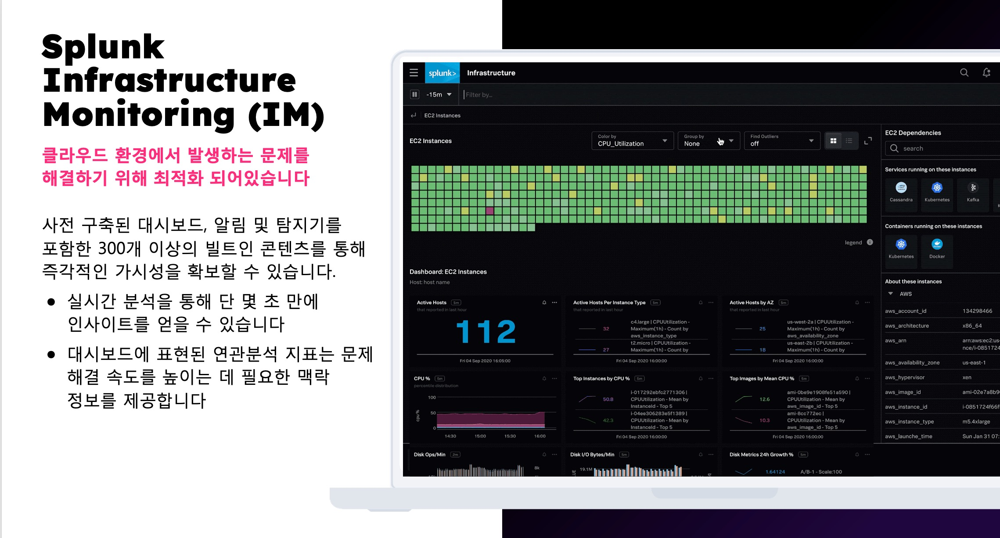
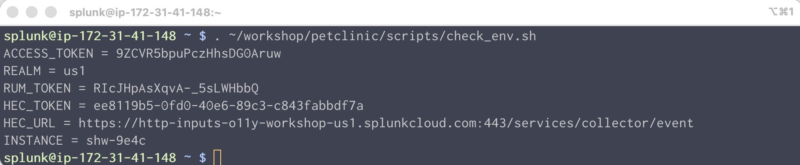

# 1. Deploy the OpenTelemetry Collector

</br>



</br>


</br>

> [!WARNING]
> **기존 OpenTelemetry 수집기를 모두 제거하세요.**
>
> 이미 Splunk OpenTelemetry가 구동중이라면 다음 커맨드를 통하여 Otel을 삭제해야합니다.
>
> ```bash
> helm delete splunk-otel-collector
> ```
>
> EC2 인스턴스에 이미 이전 버전의 컬렉터가 설치되어 있을 수 있습니다. 컬렉터를 제거하려면 다음 명령을 실행하십시오.
>
> ```bash
> curl -sSL https://dl.signalfx.com/splunk-otel-collector.sh > /tmp/splunk-otel-collector.sh
>
> sudo sh /tmp/splunk-otel-collector.sh --uninstall
> ```

</br>

## Checking your practice instance

인스턴스가 올바르게 구성되었는지 확인하기 위해 이 워크샵에 필요한 환경 변수가 올바르게 설정되었는지 확인해야 합니다. 터미널에서 다음 명령을 실행하세요.

```bash
. ~/workshop/petclinic/scripts/check_env.sh
```

출력 결과에서 다음 환경 변수들이 모두 존재하고 값이 설정되어 있는지 확인하십시오. 누락된 변수가 있으면 손을 들고 강사에게 문의 해 주세요



</br>

## Deploy the OpenTelemetry Collector

이제 해당 호스트에 에이전트를 설치 해 봅니다. 설치 방안은 여러가지가 있지만, 오늘 실습에서는 Splunk O11y Cloud UI 에서 제공하는 마법사를 통해 원하는 옵션이 미리 설정 된 스크립트를 통하여 설치를 진행합니다.

1. Splunk Observability Cloud 웹 페이지로 접속합니다

1. Splunk Access token을 미리 발급해 주세요.
   - Settings > Access Tokens > Create Token > API token
1. Install new Splunk Opentelemetry Collector(Linux 용)
   - Data Management > Splunk OpenTelemetry Collector (Linux 용)
   - 다음과 같이 설정(zero-code 부분은 체크 해제)

     

1. Install Script(10분소요)
   ```bash
   curl -sSL https://dl.signalfx.com/splunk-otel-collector.sh > /tmp/splunk-otel-collector.sh && \
   sudo sh /tmp/splunk-otel-collector.sh --realm $REALM -- $ACCESS_TOKEN --mode agent --without-instrumentation --discovery
   ```

참고 [Install the Collector for Linux with the installer script](https://docs.splunk.com/observability/en/gdi/opentelemetry/collector-linux/install-linux.html#otel-install-linux

## Confirm the Collector is Running

collector가 정상 작동되는지 확인

```bash
sudo systemctl status splunk-otel-collector
```

## collector의 로그를 어떻게 하면 볼 수 있을까요?

`journalctl`을 사용해 collector의 로그를 볼 수 있습니다:

> Press Ctrl + C to exit out of tailing the log.

```bash
sudo journalctl -u splunk-otel-collector -f -n 100
```

## Collector 설정

설정한 collector의 내용을 어디서 찾을 수 있을까요?

`/etc/otel/collector` 경로에 관련 설정들이 저장되어 있습니다. `agent` 모드로 설치했다면 관련된 내용은 `agent_config.yaml` file에 저장되어 있습니다.

## Splunk Observability IM


