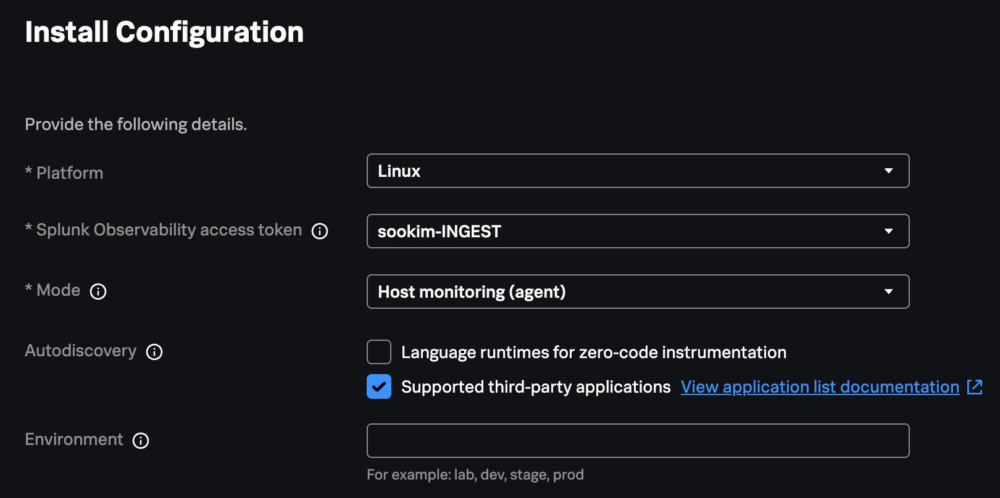
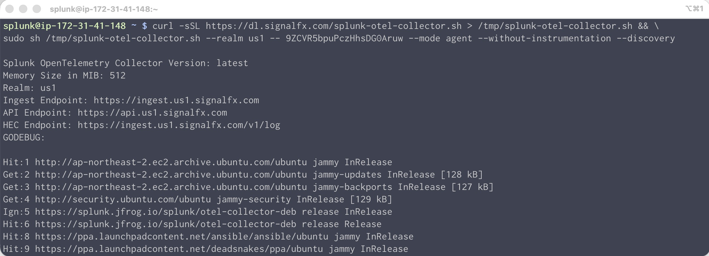
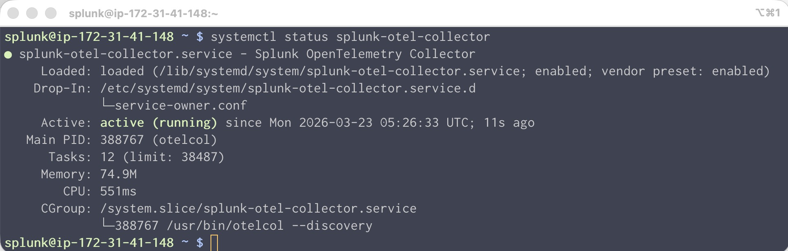
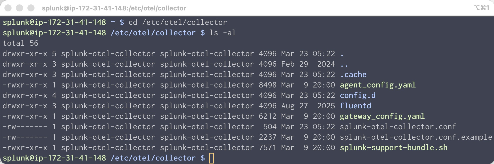
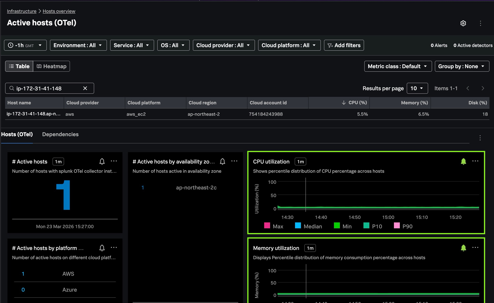

# 1. Deploy the OpenTelemetry Collector

에이전트를 설치한다는 것은, 인프라 모니터링을 시작한다는 말과 동시에 모든 유형의 텔레메트리 데이터 수집의 기본이 됩니다.

</br>


</br>


</br>

> </br>
> [!WARNING]
>
> **기존 OpenTelemetry 수집기를 모두 제거하세요.**
>
> 이미 Splunk OpenTelemetry가 구동중이라면 다음 커맨드를 통하여 Otel을 삭제해야합니다.
>
> ```bash
> helm delete splunk-otel-collector
> ```
>
> EC2 인스턴스에 이미 이전 버전의 컬렉터가 설치되어 있을 수 있습니다. 컬렉터를 제거하려면 다음 명령을 실행하십시오.
>
> ```bash
> curl -sSL https://dl.signalfx.com/splunk-otel-collector.sh > /tmp/splunk-otel-collector.sh
>
> sudo sh /tmp/splunk-otel-collector.sh --uninstall
> ```
>
> </br>

</br>

<!--
## Checking your practice instance

인스턴스가 올바르게 구성되었는지 확인하기 위해 이 워크샵에 필요한 환경 변수가 올바르게 설정되었는지 확인해야 합니다. 터미널에서 다음 명령을 실행하세요.

```bash
. ~/workshop/petclinic/scripts/check_env.sh
```

출력 결과에서 다음 환경 변수들이 모두 존재하고 값이 설정되어 있는지 확인하십시오. 누락된 변수가 있으면 손을 들고 강사에게 문의 해 주세요


</br>

-->

## Deploy the OpenTelemetry Collector

이제 해당 호스트에 에이전트를 설치 해 봅니다. 설치 방안은 여러가지가 있지만, 오늘 실습에서는 Splunk O11y Cloud UI 에서 제공하는 마법사를 통해 원하는 옵션이 미리 설정 된 스크립트를 통하여 설치를 진행합니다.

1. Splunk Observability Cloud 웹 페이지로 접속합니다

<!--
1. Splunk Access token을 미리 발급해 주세요.
   - Settings > Access Tokens > Create Token > API token
-->

2. Splunk Opentelemetry Collector 를 설치합니다
   - **[Data Management] > [Available Integration] > [Splunk OpenTelemetry Collector]**
   - Platform : Linux
   - Splunk Observability access token : **sookim-INGEST** 선택
   - Mode : **Host monitoring(agent)** 선택
   - Autodiscovery : Zero-code 부분 체크 해제
     
   - [Next] 클릭

3. Install Script

   화면에 표시된 인스톨 스크립트를 복사하여 SSH 터미널에 붙여넣기 합니다. 에이전트 구동에 필요한 패키지를 일괄 다운로드 및 설치하므로 시간이 조금 소요됩니다.

   ```bash
   curl -sSL https://dl.observability.splunkcloud.com/splunk-otel-collector.sh > /tmp/splunk-otel-collector.sh && \

   sudo sh /tmp/splunk-otel-collector.sh --with-instrumentation --deployment-environment <실습자_이름>-handson \
   --realm us1 -- 9ZCVR5bpuPczHhsDG0Aruw \
   --enable-profiler --enable-profiler-memory --enable-metrics
   ```

   

- 참고 : [Install the Collector for Linux with the installer script](https://docs.splunk.com/observability/en/gdi/opentelemetry/collector-linux/install-linux.html#otel-install-linux)

</br>

4. 에이전트를 실행시키고 제대로 구동중인지 확인합니다

   ```bash
   sudo systemctl restart splunk-otel-collector

   systemctl status splunk-otel-collector
   ```

   

</br>

## collector의 로그를 어떻게 하면 볼 수 있을까요?

`journalctl`을 사용해 collector의 로그를 볼 수 있습니다:

```bash
sudo journalctl -u splunk-otel-collector -f -n 100
```

저널 로그는 식별이 어렵습니다. 아래 명령어로 "Error" 레벨 이상의 로그를 출력하되 최신로그가 발생할때마다 실시간으로 화면에 출력하도록 해 봅시다

```bash
sudo journalctl -u splunk-otel-collector -f -n 100 -p err -o short-precise --no-pager
```

> [!NOTE]
>
> Press Ctrl + C to exit out of tailing the log.

<br>

## Collector 의 설정파일 (configuration files)은 어디에 있을까요?

에이전트가 설치되면, 기본으로 설정 된 Splunk OTel collector 의 홈이 생깁니다. 이 홈디렉토리에 모든 설정파일이 생성되고, 해당 설정파일을 변경함에 따라서 에이전트에 반영이 되게 됩니다.

`/etc/otel/collector` 경로에 관련 설정들이 저장되어 있습니다. `agent` 모드로 설치했다면 관련된 내용은 `agent_config.yaml` file에 저장되어 있습니다.

아래 명령어로 홈디렉토리에 접근 후 생성된 파일을 살펴봅시다

```bash
cd /etc/otel/collector
ls - al
```



</br>

## 데이터가 정상적으로 수집되는지 확인 해 봅시다

Splunk Observability Cloud 화면으로 가서 인프라 메트릭이 제대로 수집되는지 확인 해 봅시다.

- **[Infrastructure] > [Host Overview] > [Active Hosts(OTel)]** 타일을 눌러 네비게이터로 이동합니다
- 필터에 Hostname 으로 필터를 설정하여, 내가 실습중인 서버가 보이는지 확인합니다
  

</br>

---

**Module 1. Deploy the OpenTelemetry Collector DONE!**
