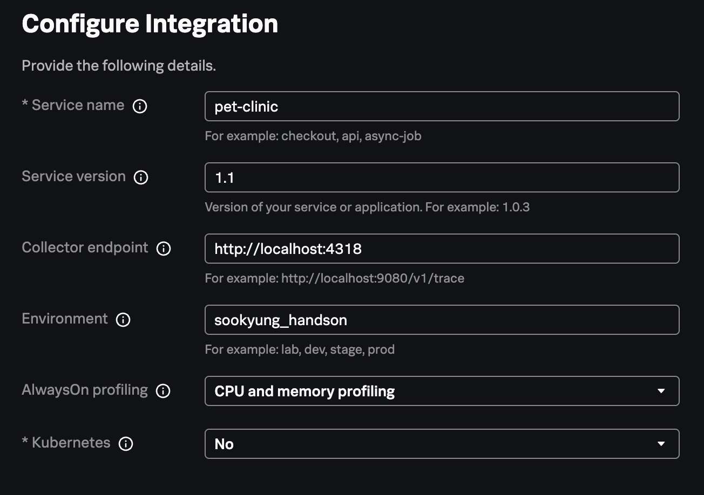
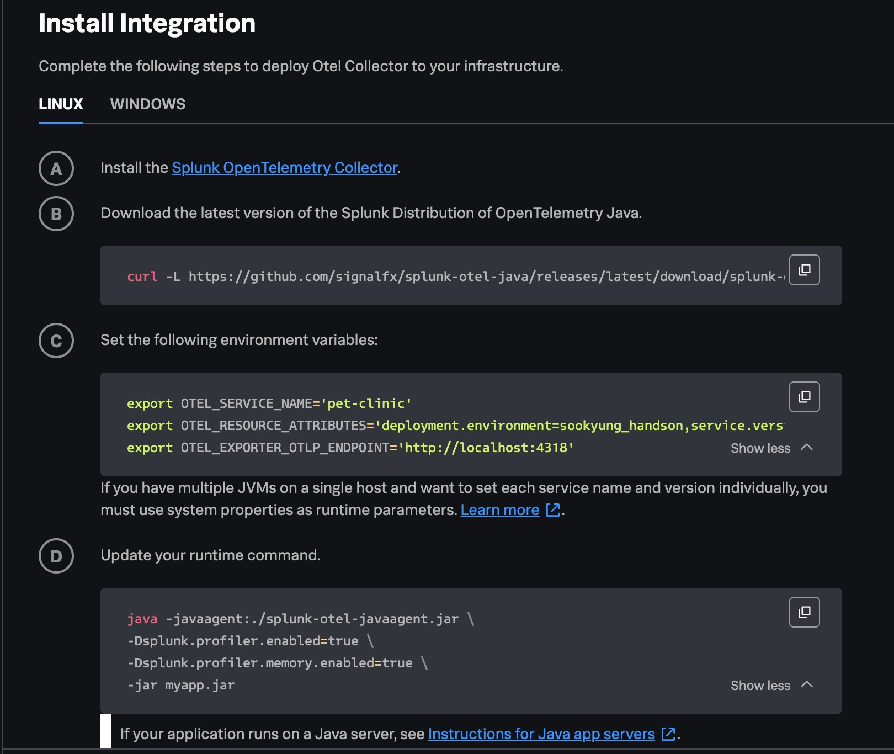
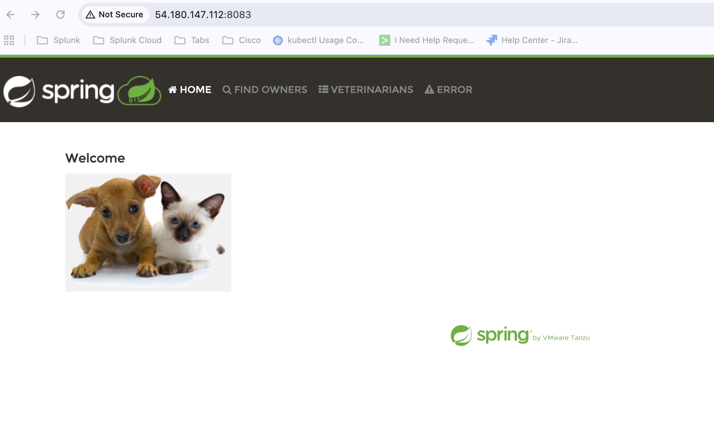
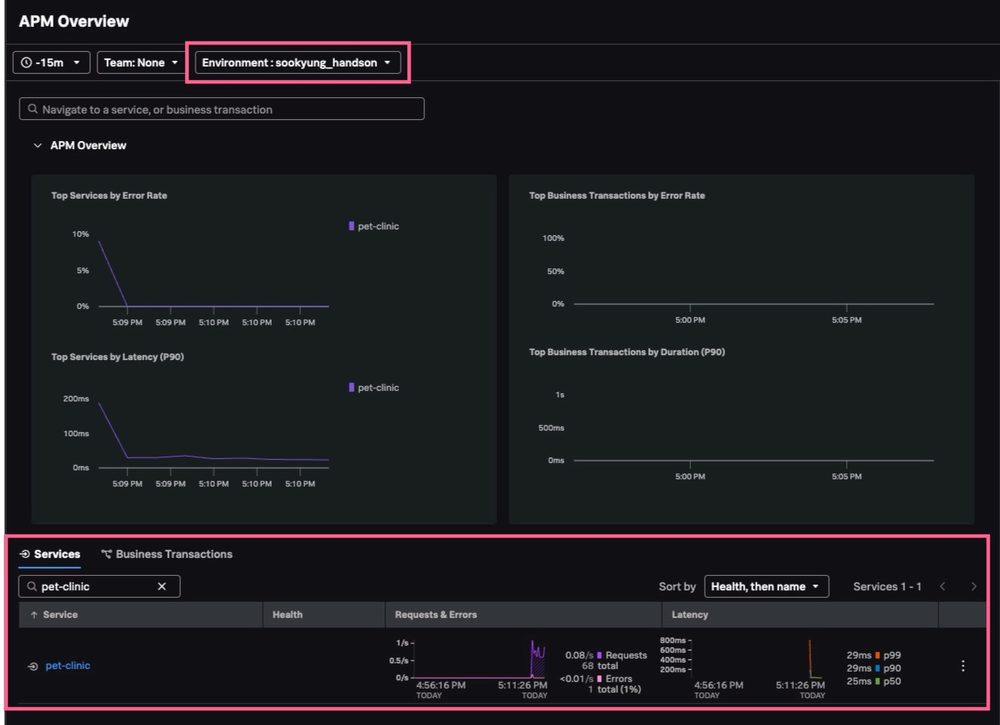
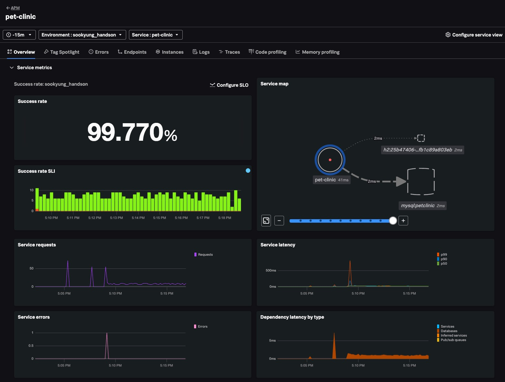

# Instrument a Java application with OpenTelemetry

</br>

## JAVA APM 연동하기

APM 을 연동하기 위해서는 APM Jar file을 다운로드 후 JAVA app 구동시 참조 할 수 있도록 옵션 설정이 필요합니다.

### 1. Splunk java agent 다운로드 하기

1. Install new Java(Opentelemetry) Instance
   - **[Data Management] > [Available Integration] > [Java]** 메뉴로 이동합니다
2. Configure Integration
   - Service Name : **Pet-clinic** 입력
   - Service Version : **1.1** 입력
   - Environment : **_<실습자 이름>_\_handson** 입력
   - Alwayson Profiling : CPU and memory profiling
     
   - [Next] 클릭
3. 아래 스크린샷과 같이 보이는 내용을 참고하여 리눅스 환경에 적용합니다
   

### 2. JAVA 재기동하기

- jar 파일을 로컬에 다운로드 합니다

  ```bash
  pwd
  /home/splunk/splunk-petclinic

  curl -L https://github.com/signalfx/splunk-otel-java/releases/latest/download/splunk-otel-javaagent.jar -o splunk-otel-javaagent.jar

  ```

- 환경 설정을 아래와 같이 해 줍니다

  ```bash
  export OTEL_SERVICE_NAME='pet-clinic'
  export OTEL_RESOURCE_ATTRIBUTES='deployment.environment=sookyung_handson,service.version=1.1'
  export OTEL_EXPORTER_OTLP_ENDPOINT='http://localhost:4318'
  ```

- Java Application을 아래 명령어로 재가동합니다

  ```bash
   java -javaagent:./splunk-otel-javaagent.jar \
  -Dserver.port=8083 \
  -Dsplunk.profiler.enabled=true \
  -Dsplunk.profiler.memory.enabled=true \
  -jar target/spring-petclinic-*.jar --spring.profiles.active=mysql
  ```

  > [!CAUTION]
  >
  > 자바 애플리케이션 구동시킬때 마지막에 myapp.jar 라고 되어있는 부분을 실제 존재하는 앱의 jar로 지정해야합니다.
  >
  > 우리 트레이닝의 경우에는 target/spring-petclinic-\*.jar 입니다
  >
  > 잊지마세요

- 아래와 같이 웹브라우저에서도 정상적으로 확인이 되는지 봅니다
  

</br>

## Splunk APM 활용 해 보기

Splunk Observability Cloud 로 들어가 APM 데이터가 수집 중인지 확인합니다

- **[APM] > [Overview]** 화면으로 이동합니다
- 화면 상단의 필터를 **Environment : _<실습자 이름>_\_handson** 으로 설정하여, 내가 설정한 APM 데이터만 추려서 확인합니다
  

</br>

- 화면 하단의 [pet-clinic] 서비스를 클릭하여 Service Centric View 화면으로 이동합니다
  

</br>

---

**Module 3. Instrument a Java application with OpenTelemetry DONE!**

<!--
  - Before
    ```bash
    java -jar target/hello-world-0.0.1-SNAPSHOT.jar
    ```
  - After
    ```bash
    java -javaagent:./splunk-otel-javaagent.jar -jar target/hello-world-0.0.1-SNAPSHOT.jar
    ```

1. Splunk O11y Cloud 화면에서 트레이스 발생 확인하기

   ```bash
   curl http://localhost:8080/hello/Tom
   Hello, Tom!%

   curl http://localhost:8080/hello
   Hello, World!%
   ```

   
   
-->
