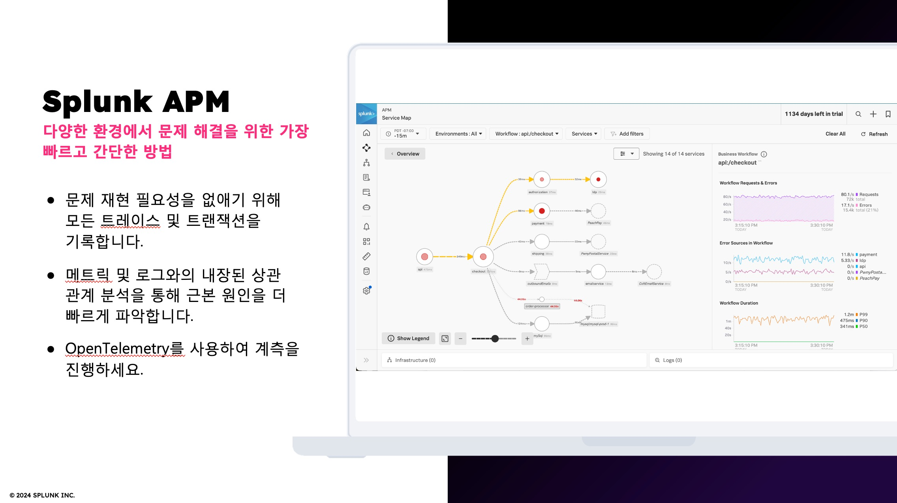
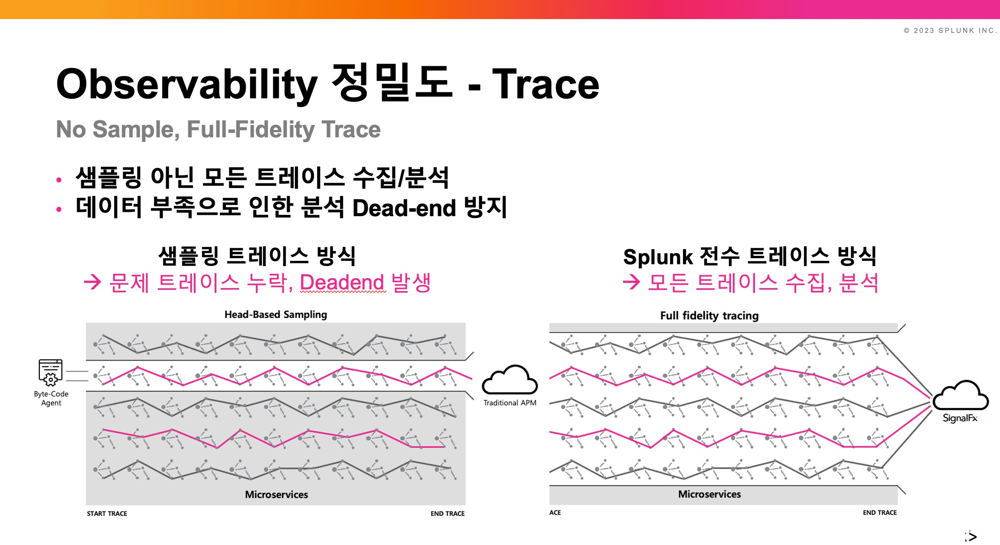

# Deploy a Java Application

</br>



</br>



</br>

## Build sample application in your host

APM을 설정하기 위해 가장 먼저 필요한 것은 애플리케이션입니다. 이번 실습에서는 Spring PetClinic 애플리케이션을 사용하겠습니다. 이 애플리케이션은 Spring 프레임워크(Springboot)로 구축된 매우 간단한 Java 샘플 애플리케이션입니다.

1. 유저 홈 디렉토리로 이동 후 샘플 앱을 클론합니다

   ```bash
   cd ~

   pwd
   /home/splunk

   git clone https://github.com/spring-projects/spring-petclinic
   ```

2. 디렉토리 이동 후 MySQL DB를 도커로 구동합니다

   ```bash
   cd spring-petclinic

   pwd
   /home/splunk/spring-petclinic

   docker run -d -e MYSQL_USER=petclinic -e MYSQL_PASSWORD=petclinic -e MYSQL_ROOT_PASSWORD=root -e MYSQL_DATABASE=petclinic -p 3306:3306 docker.io/biarms/mysql:5.7
   ```

3. PetClinic 애플리케이션에 간단한 트래픽을 생성하는 Locust를 실행하는 또 다른 컨테이너를 시작하겠습니다. Locust는 웹 애플리케이션에 트래픽을 생성하는 데 사용할 수 있는 간단한 부하 테스트 도구입니다.

   ```bash
   docker run --network="host" -d -p 8090:8090 -v ~/workshop/petclinic:/mnt/locust docker.io/locustio/locust -f /mnt/locust/locustfile.py --headless -u 1 -r 1 -H http://127.0.0.1:8083
   ```

4. 아래 명령어를 통해서 Pet Clinic 애플리케이션을 빌드합니다
   ```bash
   ./mvnw package -Dmaven.test.skip=true
   ```

</br>

## Start Pet Clinic application

1. 자신의 외부 IP주소를 확인합니다

   빌드가 완료되면 실행 중인 인스턴스의 공용 IP 주소를 확인해야 합니다. 다음 명령을 실행하여 확인할 수 있습니다.

   ```bash
   curl http://ifconfig.me
   ```

   IP 주소가 반환될 것입니다. 이 주소는 애플리케이션이 실행 중인지 확인하는 데 필요하므로 기록해 두십시오.

2. JAVA App 을 아래 명령어와 같이 실행시킵니다

   ```bash
   java -Dserver.port=8083 -jar target/spring-petclinic-*.jar
   ```

   ```bash
              |\      _,,,--,,_
             /,`.-'`'   ._  \-;;,_
   _______ __|,4-  ) )_   .;.(__`'-'__     ___ __    _ ___ _______
   |       | '---''(_/._)-'(_\_)   |   |   |   |  |  | |   |       |
   |    _  |    ___|_     _|       |   |   |   |   |_| |   |       | __ _ _
   |   |_| |   |___  |   | |       |   |   |   |       |   |       | \ \ \ \
   |    ___|    ___| |   | |      _|   |___|   |  _    |   |      _|  \ \ \ \
   |   |   |   |___  |   | |     |_|       |   | | |   |   |     |_    ) ) ) )
   |___|   |_______| |___| |_______|_______|___|_|  |__|___|_______|  / / / /
   ==================================================================/_/_/_/

   :: Built with Spring Boot :: 4.0.3

   2026-03-23T07:00:12.196Z INFO 526714 --- [ main] o.s.s.petclinic.PetClinicApplication : Starting PetClinicApplication v4.0.0-SNAPSHOT using Java 17.0.18 with PID 526714 (/home/splunk/spring-petclinic/target/spring-petclinic-4.0.0-SNAPSHOT.jar started by splunk in /home/splunk/spring-petclinic)
   2026-03-23T07:00:12.205Z INFO 526714 --- [ main] o.s.s.petclinic.PetClinicApplication : No active profile set, falling back to 1 default profile: "default"
   2026-03-23T07:00:13.371Z INFO 526714 --- [ main] .s.d.r.c.RepositoryConfigurationDelegate : Bootstrapping Spring Data JPA repositories in DEFAULT mode.
   2026-03-23T07:00:13.444Z INFO 526714 --- [ main] .s.d.r.c.RepositoryConfigurationDelegate : Finished Spring Data repository scanning in 60 ms. Found 3 JPA repository interfaces.
   2026-03-23T07:00:14.317Z INFO 526714 --- [ main] o.s.boot.tomcat.TomcatWebServer : Tomcat initialized with port 8083 (http)
    2026-03-23T07:00:14.335Z INFO 526714 --- [ main] o.apache.catalina.core.StandardService : Starting service [Tomcat]
    2026-03-23T07:00:14.336Z INFO 526714 --- [ main] o.apache.catalina.core.StandardEngine : Starting Servlet engine: [Apache Tomcat/11.0.18]
    2026-03-23T07:00:14.378Z INFO 526714 --- [ main] b.w.c.s.WebApplicationContextInitializer : Root WebApplicationContext: initialization completed in 2092 ms
    2026-03-23T07:00:14.635Z INFO 526714 --- [ main] com.zaxxer.hikari.HikariDataSource : HikariPool-1 - Starting...
    2026-03-23T07:00:14.864Z INFO 526714 --- [ main] com.zaxxer.hikari.pool.HikariPool : HikariPool-1 - Added connection conn0: url=jdbc:h2:mem:3796dc36-191a-4394-8911-1310bdad68a6 user=SA
    2026-03-23T07:00:14.865Z INFO 526714 --- [ main] com.zaxxer.hikari.HikariDataSource : HikariPool-1 - Start completed.
    2026-03-23T07:00:15.056Z INFO 526714 --- [ main] org.hibernate.orm.jpa : HHH008540: Processing PersistenceUnitInfo [name: default]
    2026-03-23T07:00:15.116Z INFO 526714 --- [ main] org.hibernate.orm.core : HHH000001: Hibernate ORM core version 7.2.4.Final
    2026-03-23T07:00:15.595Z INFO 526714 --- [ main] o.s.o.j.p.SpringPersistenceUnitInfo : No LoadTimeWeaver setup: ignoring JPA class transformer
    2026-03-23T07:00:15.690Z INFO 526714 --- [ main] org.hibernate.orm.connections.pooling : HHH10001005: Database info:
    Database JDBC URL [jdbc:h2:mem:3796dc36-191a-4394-8911-1310bdad68a6]
    Database driver: H2 JDBC Driver
    Database dialect: H2Dialect
    Database version: 2.4.240
    Default catalog/schema: 3796DC36-191A-4394-8911-1310BDAD68A6/PUBLIC
    Autocommit mode: undefined/unknown
    Isolation level: READ_COMMITTED [default READ_COMMITTED]
    JDBC fetch size: 100
    Pool: DataSourceConnectionProvider
    Minimum pool size: undefined/unknown
    Maximum pool size: undefined/unknown
   ```

3. 애플리케이션이 성공적으로 구동되었다면, 웹 브라우저에 다음과 같이 접속하여 확인합니다

   http://_ip-address_:8083

   

</br>

4. 앱을 종료합니다

   성공적으로 앱이 구동되는걸 확인하였다면, Ctrl+C 로 앱을 종료하고 다음 단계로 넘어갑니다

--

**Module 1-2. Deploy a Java Application DONE!**

<!--

해당 어플리케이션을 구동하기 위해서는 Java 어플리케이션을 구동하기 위한 프로그램(Java, maven 등)이 필요합니다.

- 설치

```bash
sudo apt update
sudo apt install openjdk-17-jdk
sudo apt install maven
````

- 설치 확인

```bash
java -version
mvn -version
```

- 프로젝트 구조 생성

```bash
 mvn archetype:generate \
  -DgroupId=com.example.helloworld \
  -DartifactId=hello-world \
  -DarchetypeArtifactId=maven-archetype-quickstart \
  -DinteractiveMode=false
```

```bash
hello-world/
├── pom.xml
└── src
    ├── main
    │   └── java
    │       └── com
    │           └── example
    │               └── helloworld
    │                   └── App.java
    └── test
        └── java
            └── com
                └── example
                    └── helloworld
                        └── AppTest.java
```

- 여기서 불필요한 디렉토리를 삭제합니다

```bash
cd hello-world/src/
rm -rf test
```

- App 코드 디렉토리로 이동하여 Hello World 코드를 작성합니다

```bash
cd hello-world/src/main/java/com/example/helloworld/

vi HelloWorldApplication.java
```

- HelloWorldApplication.java 코드

```java
package com.example.helloworld;

import org.springframework.boot.SpringApplication;
import org.springframework.boot.autoconfigure.SpringBootApplication;
import org.springframework.web.bind.annotation.*;
import org.slf4j.Logger;
import org.slf4j.LoggerFactory;

@SpringBootApplication
@RestController
public class HelloWorldApplication {

    private static final Logger logger = LoggerFactory.getLogger(HelloWorldApplication.class);

    public static void main(String[] args) {
        SpringApplication.run(HelloWorldApplication.class, args);
    }

    @GetMapping("/hello/{name}")
    public String hello(@PathVariable(required = false) String name) {
        if (name == null || name.isEmpty()) {
            logger.info("/hello endpoint invoked anonymously");
            return "Hello, World!";
        } else {
            logger.info("/hello endpoint invoked by {}", name);
            return String.format("Hello, %s!", name);
        }
    }

    @GetMapping("/hello")
    public String helloNoName() {
        return hello(null);
    }
}

```

- hello-world 루트 디렉토리로 이동하여 pom.xml 코드를 작성합니다

```bash
cd ~/hello-world

vi pom.xml
```

- pom.xml 코드

```xml
<project xmlns="http://maven.apache.org/POM/4.0.0"
         xmlns:xsi="http://www.w3.org/2001/XMLSchema-instance"
         xsi:schemaLocation="http://maven.apache.org/POM/4.0.0
         http://maven.apache.org/xsd/maven-4.0.0.xsd">
    <modelVersion>4.0.0</modelVersion>
    <groupId>com.example</groupId>
    <artifactId>hello-world</artifactId>
    <version>0.0.1-SNAPSHOT</version>
    <packaging>jar</packaging>
    <name>Hello World Application</name>

    <parent>
        <groupId>org.springframework.boot</groupId>
        <artifactId>spring-boot-starter-parent</artifactId>
        <version>3.2.5</version>
    </parent>

    <dependencies>
        <dependency>
            <groupId>org.springframework.boot</groupId>
            <artifactId>spring-boot-starter-web</artifactId>
        </dependency>
    </dependencies>

    <build>
        <plugins>
            <plugin>
                <groupId>org.springframework.boot</groupId>
                <artifactId>spring-boot-maven-plugin</artifactId>
            </plugin>
        </plugins>
    </build>
</project>
```

- 앱 빌드

```bash
mvn clean package
```

- 앱 실행

```bash
java -jar target/hello-world-0.0.1-SNAPSHOT.jar

```

- 앱이 실행되면 터미널 창을 하나 더 열어서 curl을 통해 어플리케이션에 요청을 보낼 수 있습니다.

```bash
curl http://localhost:8080/hello
Hello, World!%

curl http://localhost:8080/hello/Tom
Hello, Tom!%
```

```bash

  .   ____          _            __ _ _
 /\\ / ___'_ __ _ _(_)_ __  __ _ \ \ \ \
( ( )\___ | '_ | '_| | '_ \/ _` | \ \ \ \
 \\/  ___)| |_)| | | | | || (_| |  ) ) ) )
  '  |____| .__|_| |_|_| |_\__, | / / / /
 =========|_|==============|___/=/_/_/_/
 :: Spring Boot ::                (v3.2.5)

2025-06-10T01:36:35.426Z  INFO 1110760 --- [           main] c.e.helloworld.HelloWorldApplication     : Starting HelloWorldApplication v0.0.1-SNAPSHOT using Java 17.0.15 with PID 1110760 (/home/splunk/hello-world/target/hello-world-0.0.1-SNAPSHOT.jar started by splunk in /home/splunk/hello-world)
2025-06-10T01:36:35.431Z  INFO 1110760 --- [           main] c.e.helloworld.HelloWorldApplication     : No active profile set, falling back to 1 default profile: "default"
2025-06-10T01:36:36.467Z  INFO 1110760 --- [           main] o.s.b.w.embedded.tomcat.TomcatWebServer  : Tomcat initialized with port 8080 (http)
2025-06-10T01:36:36.481Z  INFO 1110760 --- [           main] o.apache.catalina.core.StandardService   : Starting service [Tomcat]
2025-06-10T01:36:36.482Z  INFO 1110760 --- [           main] o.apache.catalina.core.StandardEngine    : Starting Servlet engine: [Apache Tomcat/10.1.20]
2025-06-10T01:36:36.526Z  INFO 1110760 --- [           main] o.a.c.c.C.[Tomcat].[localhost].[/]       : Initializing Spring embedded WebApplicationContext
2025-06-10T01:36:36.527Z  INFO 1110760 --- [           main] w.s.c.ServletWebServerApplicationContext : Root WebApplicationContext: initialization completed in 970 ms
2025-06-10T01:36:36.899Z  INFO 1110760 --- [           main] o.s.b.w.embedded.tomcat.TomcatWebServer  : Tomcat started on port 8080 (http) with context path ''
2025-06-10T01:36:36.915Z  INFO 1110760 --- [           main] c.e.helloworld.HelloWorldApplication     : Started HelloWorldApplication in 1.992 seconds (process running for 2.486)
2025-06-10T01:37:17.944Z  INFO 1110760 --- [nio-8080-exec-1] o.a.c.c.C.[Tomcat].[localhost].[/]       : Initializing Spring DispatcherServlet 'dispatcherServlet'
2025-06-10T01:37:17.944Z  INFO 1110760 --- [nio-8080-exec-1] o.s.web.servlet.DispatcherServlet        : Initializing Servlet 'dispatcherServlet'
2025-06-10T01:37:17.945Z  INFO 1110760 --- [nio-8080-exec-1] o.s.web.servlet.DispatcherServlet        : Completed initialization in 1 ms
2025-06-10T01:37:17.980Z  INFO 1110760 --- [nio-8080-exec-1] c.e.helloworld.HelloWorldApplication     : /hello endpoint invoked anonymously
2025-06-10T01:38:57.567Z  INFO 1110760 --- [nio-8080-exec-2] c.e.helloworld.HelloWorldApplication     : /hello endpoint invoked by Tom
```

Java 앱이 정상적으로 구동되는 것이 확인 된다면 Ctrl+C를 눌러 앱을 종료합니다

-->
