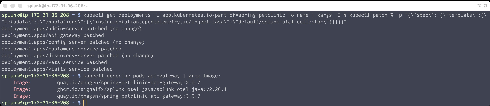

# Instrument a Java application with OpenTelemetry

자동 검색 및 구성을 설정하려면 배포에 계측 어노테이션을 추가하는 패치를 적용해야 합니다. 패치가 적용되면 OpenTelemetry Collector가 자동 검색 및 구성 라이브러리를 주입하고 Pod가 재시작되어 추적 및 프로파일링 데이터를 전송하기 시작합니다. 먼저 다음 명령어로 `api-gateway` 파드를 조회하여 `splunk-otel-java` 이미지가 있는지 확인하십시오.

```bash
kubectl describe pods api-gateway | grep Image:
```

</br>

## JAVA Zero-code APM 연동하기 (Auto-Instrument)

우리가 OTel 에이전트를 맨 처음 설치할 때 추가 했던 옵션이 기억 나시나요?

- --set="operator.enabled=true" 옵션을 통해 제로코드 계측에 필요한 라이브러리를 다운로드 받았습니다
- --set="environment=sookyung-handson", 옵션을 통해서 APM 에 태그로 동작 할 env 정보에 대해서 선언 했습니다.
- --set="splunkObservability.profilingEnabled=true" 옵션을 통해서 APM 의 확장기능인 프로파일링 기능을 활성화 하였습니다

위 옵션을 통해서 우리는 Zero-code Instrument를 할 준비 끝난 것입니다.

아래처럼 배포에 어노테이션을 추가하여 모든 서비스에 대한 Java 자동 검색 및 구성을 활성화합니다. 다음 명령은 모든 배포에 패치를 적용합니다. 그러면 OpenTelemetry Operator가 이미지를 splunk-otel-javaPod에 주입합니다.

```bash
kubectl get deployments -l app.kubernetes.io/part-of=spring-petclinic -o name | xargs -I % kubectl patch % -p "{\"spec\": {\"template\":{\"metadata\":{\"annotations\":{\"instrumentation.opentelemetry.io/inject-java\":\"default/splunk-otel-collector\"}}}}}"
```

아래 명령어를 다시 입력하여 `ghcr.ioapi-gateway` 이미지가 추가되었는지 확인합니다

```bash
kubectl describe pods api-gateway | grep Image:
```



</br>

## Splunk APM 활용 해 보기

Splunk Observability Cloud 로 들어가 APM 데이터가 수집 중인지 확인합니다

- **[APM] > [Overview]** 화면으로 이동합니다
- 화면 상단의 필터를 **Environment : _<실습자 이름>_\_handson** 으로 설정하여, 내가 설정한 APM 데이터만 추려서 확인합니다
  

</br>

- 화면 하단의 [pet-clinic] 서비스를 클릭하여 Service Centric View 화면으로 이동합니다
  

</br>

<!--

## JAVA APM 연동하기 (Manual Instrument)

APM 을 연동하기 위해서는 APM Jar file을 다운로드 후 JAVA app 구동시 참조 할 수 있도록 옵션 설정이 필요합니다.

### 1. Splunk java agent 다운로드 하기

1. Install new Java(Opentelemetry) Instance
   - **[Data Management] > [Available Integration] > [Java]** 메뉴로 이동합니다
2. Configure Integration
   - Service Name : **Pet-clinic** 입력
   - Service Version : **1.1** 입력
   - Environment : **_<실습자 이름>_\_handson** 입력
   - Alwayson Profiling : CPU and memory profiling
     
   - [Next] 클릭
3. 아래 스크린샷과 같이 보이는 내용을 참고하여 리눅스 환경에 적용합니다
   

### 2. JAVA 재기동하기

- jar 파일을 로컬에 다운로드 합니다

  ```bash
  pwd
  /home/splunk/splunk-petclinic

  curl -L https://github.com/signalfx/splunk-otel-java/releases/latest/download/splunk-otel-javaagent.jar -o splunk-otel-javaagent.jar

  ```

- 환경 설정을 아래와 같이 해 줍니다

  ```bash
  export OTEL_SERVICE_NAME='pet-clinic'
  export OTEL_RESOURCE_ATTRIBUTES='deployment.environment=sookyung_handson,service.version=1.1'
  export OTEL_EXPORTER_OTLP_ENDPOINT='http://localhost:4318'
  ```

- Java Application을 아래 명령어로 재가동합니다

  ```bash
   java -javaagent:./splunk-otel-javaagent.jar \
  -Dserver.port=8083 \
  -Dsplunk.profiler.enabled=true \
  -Dsplunk.profiler.memory.enabled=true \
  -jar target/spring-petclinic-*.jar --spring.profiles.active=mysql
  ```

  > [!CAUTION]
  >
  > 자바 애플리케이션 구동시킬때 마지막에 myapp.jar 라고 되어있는 부분을 실제 존재하는 앱의 jar로 지정해야합니다.
  >
  > 우리 트레이닝의 경우에는 target/spring-petclinic-\*.jar 입니다
  >
  > 잊지마세요

- 아래와 같이 웹브라우저에서도 정상적으로 확인이 되는지 봅니다
  

-->

</br>

---

**Module 3. Instrument a Java application DONE!**
