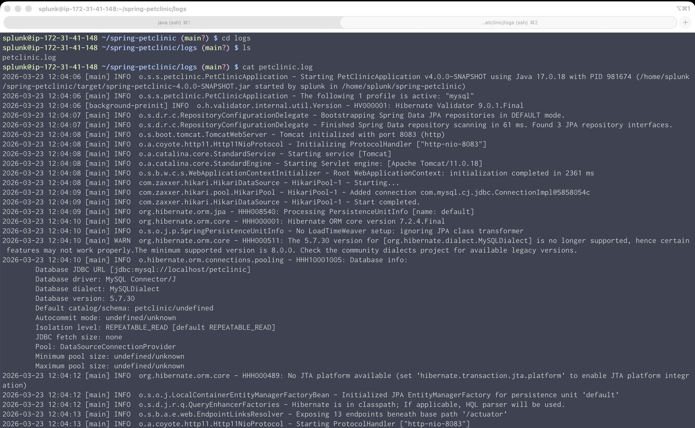
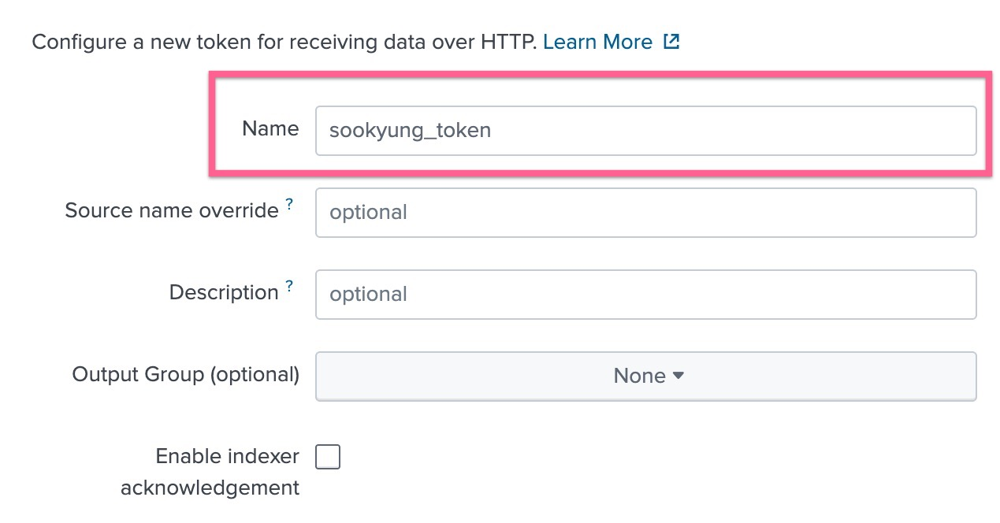
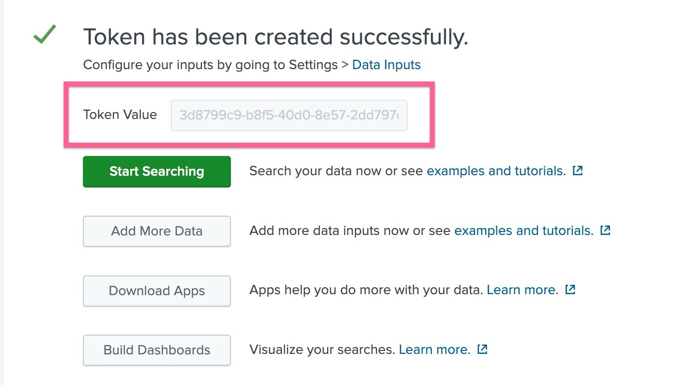
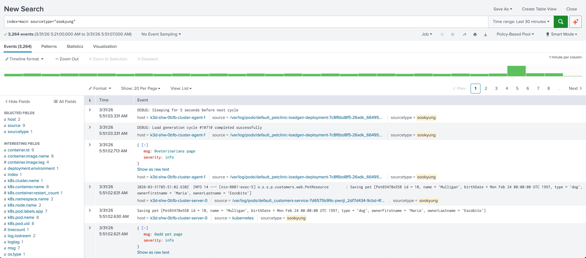
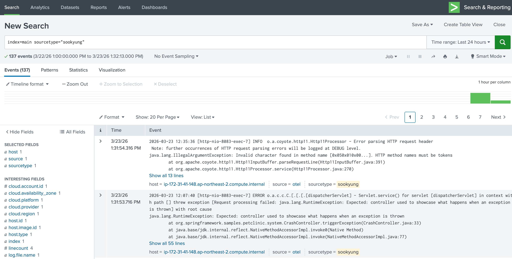

# 1-9. Collect logs to Splunk Cloud

<!--Host/Linux 환경은 해당 내용을 참조하세요-->

로그 수집은 Splunk Cloud 또는 Enterprise 로 해야합니다. 기본적으로 O11y Cloud 엔진은 로그를 저장하지 않기 때문에 HEC 엔드포인트를 통해 Splunk 코어 엔진으로 로그를 보내도록 설정합니다.

본 워크샵에서는 핸즈온을 해보실 수 있는 Splunk Cloud 를 제공드리며, 해당 스플렁크 엔진으로 Linux 환경에서 발생하는 로그를 어떻게 보낼 수 있을지에 대한 설정과 Splunk Cloud에 접속하여 확인까지 진행합니다

</br>

<!--

## 1. Set up logging in your application

현재 이 PetClinic 애플리케이션은 콘솔로만 로그를 출력 할 뿐, 아무곳에도 로그를 남기고 있지 않습니다. 따라서 INFO, ERROR 로그를 우선 파일 형태로 떨굴 수 있도록 스프링부트 설정을 변경하고 새로 빌드를 하도록 하겠습니다.

1. 설정 파일 경로로 이동하여 xml 파일을 생성합니다

   ```bash
   cd /home/splunk/spring-petclinic/src/main/resources

   vi logback-spring.xml
   ```

2. 아래와 같이 xml 파일 내용을 입력하고 저장합니다

   ```xml

   <?xml version="1.0" encoding="UTF-8"?>
   <configuration>

       <property name="LOG_PATH" value="logs" />
       <property name="LOG_FILE_NAME" value="petclinic.log" />


       <appender name="CONSOLE" class="ch.qos.logback.core.ConsoleAppender">
           <encoder>
               <pattern>%d{yyyy-MM-dd HH:mm:ss} [%thread] %-5level %logger{36} - %msg%n</pattern>
           </encoder>
       </appender>


       <appender name="FILE" class="ch.qos.logback.core.rolling.RollingFileAppender">
           <file>${LOG_PATH}/${LOG_FILE_NAME}</file>
           <rollingPolicy class="ch.qos.logback.core.rolling.TimeBasedRollingPolicy">
               <fileNamePattern>${LOG_PATH}/petclinic.%d{yyyy-MM-dd}.log</fileNamePattern>
               <maxHistory>30</maxHistory>
           </rollingPolicy>
           <encoder>
               <pattern>%d{yyyy-MM-dd HH:mm:ss} [%thread] %-5level %logger{36} - %msg%n</pattern>
           </encoder>
       </appender>


       <root level="INFO">
           <appender-ref ref="CONSOLE" />
           <appender-ref ref="FILE" />
       </root>
   </configuration>
   ```

3. 프로젝트 루트로 이동하여 펫클리닉을 다시 빌드합니다

   ```bash
   cd ~/spring-petclinic

   ./mvnw package -Dmaven.test.skip=true
   ```

4. 애플리케이션을 재기동 합니다

   ```bash
   java -Dserver.port=8083 -jar target/spring-petclinic-*.jar --spring.profiles.active=mysql
   ```

5. 로그 디렉토리 및 로그파일이 생성되었나요? 확인 해 봅시다

   ```bash
   cd logs

   cat petclinic.log
   ```

   

</br>

위 단계가 성공적으로 완료되었다면, 이제 로그수집 실습을 할 준비가 된 것입니다. 아래 절차를 따라 Splunk 코어 플랫폼으로 로그를 수집 해 봅시다

</br>

-->

## 2. Collect file logs in Splunk Cloud

로그 수집을 위한 플랫폼은 Observability Cloud 핸즈온 환경 접속 정보파일에서 확인 할 수 있습니다.

실습을 위해서는 하나의 플랫폼만 이용하면 되므로, 왼쪽 칼럼에 Splunk Cloud URL과 admin, Password 정보를 참조 하도록 합니다.

1. Splunk Cloud 를 인증하기 위한 토큰을 생성합니다
   - Splunk Cloud 화면에서 **[Settings] > [Data Input]** 메뉴로 이동하여 **[Http Event Collector]** 오른쪽에 있는 **[Add New]** 버튼을 클릭합니다
   - Name : <실습자 이름>\_token
     
   - 모두 Next 를 누르고 생성을 완료합니다
   - 완료 화면에 뜨는 Token Value 를 복사하여 기록 해 둡니다
     

</br>

2. Splunk o11y cloud 설정파일에서 로그를 전송 할 수 있도록 configuration을 수정합니다. 리눅스 환경으로 다시 돌아가서 설정파일 경로로 이동합니다

   ```bash
   cd ~/workshop/k3s/

   vi values.yaml
   ```

   아래와 같이 인증 정보 설정 부분을 수정 후 저장합니다

   ```bash
   splunkPlatform:
    # splunk http event collector(hec) endpoint 추가
    endpoint: 'https://http-inputs-samsung.stg.splunkcloud.com/services/collector'
    # Splunk Cloud에서 발급한 hec token 기입
    token: 'bc77efcf-fc60-494f-b80c-52701d7901d4'

    # log를 저장하고 싶은 Index 기입
    index: 'main'
    ---
    ---
    # Source Type 을 본인 이름으로 지정하여 구별될 수 있도록 합니다
    sourcetype: 'SooKyung'
   ```

<!--
   이제는 어떤 로그를 수집할 것인지에 대한 설정을 진행합니다

   ```bash
   sudo vi agent_config.yaml
   ```

   아래와 같이 로그 파일 경로와 내보내기 옵션을 수정 후 저장합니다

   ```bash
   # agent_config.yaml

   receivers:
    filelog:
      include:
        - /home/splunk/spring-petclinic/logs/petclinic.log  # 반드시 절대 경로를 적어주세요
      start_at: beginning
      include_file_path: true
      include_file_name: true

   exporters:
    splunk_hec:
      sourcetype: "sookyung" #로그 식별을 위해 실습자 본인의 이름을 적어주세요

   service:
    pipelines:
      logs:
        receivers: [filelog] #기존 내용에 filelog 만 추가로 적어주세요
   ```

</br>

-->

<!--

## 2. Collect file logs in Splunk Enterprise

로그 수집을 위한 플랫폼은 [Observability Enterprise 핸즈온 환경 접속 정보](https://cisco.box.com/s/zi4ws67vlkeaqbiw39t7ochkpgnc7q9c) 파일에서 확인 할 수 있습니다.

실습을 위해서는 하나의 플랫폼만 이용하면 되므로, 왼쪽 칼럼에 Splunk Cloud URL과 admin, Password 정보를 참조 하도록 합니다.

1. Splunk Cloud 를 인증하기 위한 토큰을 생성합니다
   - Splunk Cloud 화면에서 **[Settings] > [Data Input]** 메뉴로 이동하여 **[Http Event Collector]** 오른쪽에 있는 **[Add New]** 버튼을 클릭합니다
   - Name : <실습자 이름>\_token
     
   - 모두 Next 를 누르고 생성을 완료합니다
   - 완료 화면에 뜨는 Token Value 를 복사하여 기록 해 둡니다
     

</br>

2. Splunk o11y cloud 설정파일에서 로그를 전송 할 수 있도록 configuration을 수정합니다. 리눅스 환경으로 다시 돌아가서 설정파일 경로로 이동합니다

   ```bash
   cd /etc/otel/collector

   sudo vi splunk-otel-collector.conf
   ```

   아래와 같이 인증 정보 설정 부분을 수정 후 저장합니다

   ```bash
   # splunk-otel-collector.conf

   SPLUNK_HEC_URL=http://52.20.236.243:8088/services/collector/event
   SPLUNK_HEC_TOKEN=<생성한 토큰 입력>
   ```

   이제는 어떤 로그를 수집할 것인지에 대한 설정을 진행합니다

   ```bash
   sudo vi agent_config.yaml
   ```

   아래와 같이 로그 파일 경로와 내보내기 옵션을 수정 후 저장합니다

   ```bash
   # agent_config.yaml

   receivers:
    filelog:
      include:
        - /home/splunk/spring-petclinic/logs/petclinic.log  # 반드시 절대 경로를 적어주세요
      start_at: beginning
      include_file_path: true
      include_file_name: true

   exporters:
    splunk_hec:
      sourcetype: "sookyung" #로그 식별을 위해 실습자 본인의 이름을 적어주세요

   service:
    pipelines:
      logs:
        receivers: [filelog] #기존 내용에 filelog 만 추가로 적어주세요
   ```

   -->

3. 설정을 완료했다면 에이전트를 재배포합니다

   ```bash
   helm upgrade splunk-otel-collector -f values.yaml splunk-otel-collector-chart/splunk-otel-collector
   ```

   </br>

4. Splunk Cloud 로 가서 로그가 제대로 수집되는지 확인하세요
   - **[Apps] > [Search & Reporting]** 메뉴로 이동합니다
   - 검색창에 아래와 같이 입력하여 내가 설정한 로그가 수집되는지 확인합니다

   `index=main sourcetype=<실습자이름>`

    
   - 위 스크린샷 처럼 아랫쪽에 수집되는 로그가 표시된다면 성공입니다

</br>

## 3. Challenge!! 🚀

로그를 잘 살펴보신 분들은 아시겠지만, 멀티라인으로 기록되는 자바 로그가 줄바꿈이 될 때마다 따로 수집되는 것을 확인 할 수 있습니다.

다음 실습을 진행하는데는 지장이 없지만 실습을 해보고 싶으신 분들은 아래 내용을 따라 Multi-line aggregation 을 테스트 해 봅니다.

- 리눅스 환경에서 agent_config.yaml 파일을 열어 수정합니다

  ```bash
  cd /etc/otel/collector

  sudo vi agent_config.yaml
  ```

- 아래와 같이 멀티라인 설정을 넣은 후 저장합니다

  ```bash
  # agent_config.yaml

  receivers:
   filelog:
     include:
       - /home/splunk/spring-petclinic/logs/petclinic.log
     start_at: beginning
     multiline:
      line_start_pattern: '^\d{4}-\d{2}-\d{2} \d{2}:\d{2}:\d{2}'
     include_file_path: true
     include_file_name: true
  ```

- 설정을 완료했다면 에이전트를 재시작합니다

  ```bash
  sudo systemctl restart splunk-otel-collector

  systemctl status splunk-otel-collector
  ```

- 이제 다시 Splunk Cloud 로 가서 로그를 검색 해 봅니다. 여러 줄의 로그가 하나의 로그로 인식되어 처리됐나요?
  

</br>

---

**Module 4. Collect logs to Splunk Cloud DONE!**

<!--
     K8S 환경은 해당내용을 참조하세요

로그 수집은 Splunk Cloud 또는 Cloud 로 해야합니다. 기본적으로 O11y Cloud 엔진은 로그를 저장하지 않기 때문에 HEC 엔드포인트를 통해 Splunk 코어 엔진으로 로그를 보내도록 설정합니다.

본 워크샵에서는 Splunk Cloud 를 제공드리며, 해당 스플렁크 엔진으로 K8S 파드에서 발생하는 StdOut 로그를 어떻게 보낼 수 있을지에 대한 설정과 Splunk Cloud에 접속하여 확인까지 진행합니다

## 1. values.yaml 수정

앞선 워크샵에서 사용했던 values.yaml 을 수정하여 로그를 받을 수 있도록 설정합니다

```bash
cd ~/hello-world/k8s-yaml
vi values.yaml
```

```yaml
splunkPlatform:
  # splunk http event collector(hec) endpoint 추가
  endpoint: 'https://http-inputs-scv-shw-526ab544779b1f.stg.splunkcloud.com/services/collector'
  # Splunk Cloud에서 발급한 hec token 기입
  token: 'bc77efcf-fc60-494f-b80c-52701d7901d4'

  # log를 저장하고 싶은 Index 기입
  index: 'main'
---
---
# Source Type 을 본인 이름으로 지정하여 구별될 수 있도록 합니다
sourcetype: 'SooKyung'
```

## 2. helm 재배포

```bash
helm upgrade splunk-otel-collector -f values.yaml splunk-otel-collector-chart/splunk-otel-collector
```

## 3. 로그 수집 확인

Splunk Cloud 로 접속합니다

- URL : https://scv-shw-526ab544779b1f.stg.splunkcloud.com/
- User : admin
- PW : v&ep%#c%\_&k^7hb0&pT%98X523P_L_G%0j33_0igpDpQNxw%kA30cJvs2p4e#l%7

서치 구문을 아래와 같이 입력하여 로그가 검색되는지 확인합니다

```SQL
index=main sourcetype=SooKyung
```


-->
