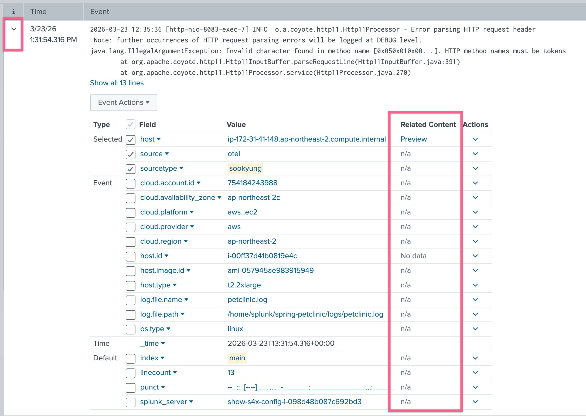
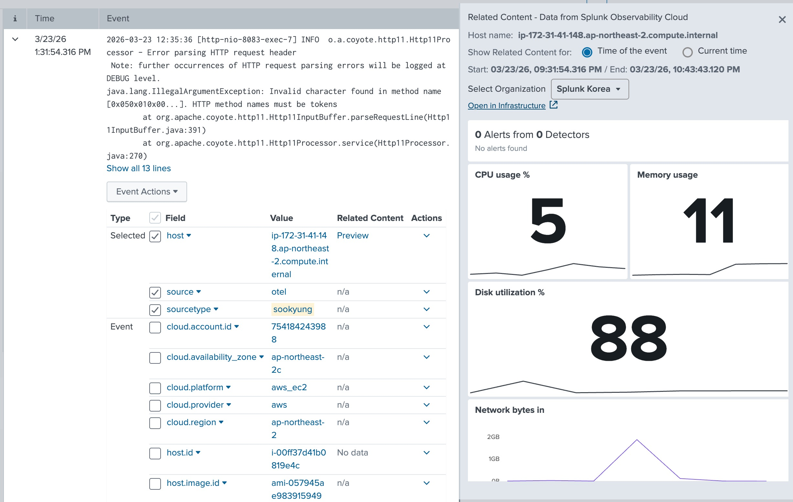
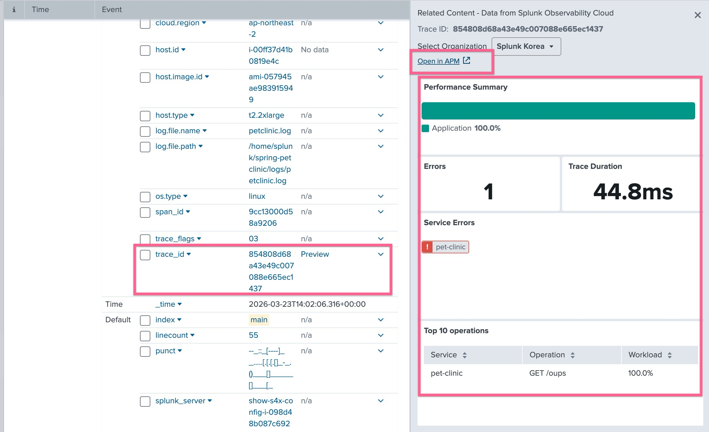

# 5. Related Contents 로 데이터 통합분석 하기

**Splunk Cloud/Enterprise 와 O11y Cloud의 Integration**

Splunk Observabiltiy Cloud 와 Splunk Cloud는 두개의 URL로 각각 존재합니다.
장애 분석시 많은 불편함이 있고, 스플렁크는 이 두개의 플랫폼을 통합하는 과정에 있습니다.

통합의 중심은 Splunk Enterprise 이며, Splunk 로그 플랫폼에서 Splunk O11y 데이터를 분석 할 수 있습니다.

## 1. Set Up related content for Infra monitoring

Splunk Enterprise UI에서, **[Apps] > [Discover Splunk Observability Cloud]**

- Realm: us1
- Access Token: Splunk Observability Cloud의 **[Settings] > [Acces Tokens]** 에서 확인 가능하지만, 이번 워크샵에서는 미리 생성된 토큰을 사용합니다

    

- 자동 UI 업데이트: enable
- Field aliasing: enable

**Related Contents가 적용되는데는 약 1~2분 정도 소요됩니다**

- 다시 로그를 검색하여 로그라인을 확장했을 때 Related Content 라는 칼럼이 생겼는지 확인합니다.

    

- Preview 를 눌러보면 관련 Host 의 메트릭이 표현됩니다
  

 

## 2. Related Content for APM

연결 된 데이터를 보면 로그가 가지고 있는 정보가 hostname 밖에 없기 때문에 해당 정보로 맵핑을 한다는 것을 알 수 있습니다. 시스템 관리자는 인프라 뿐 아니라 APM 과도 연계분석이 필요하기때문에 APM과의 연결도 살펴봐야합니다

- 검색 SPL문을 아래와 같이 수정하여 로그가 검색되는지 확인합니다

  `index=main sourcetype=<실습자이름> trace_id=*`

- 로그 하나를 확장하여 스크롤 해 보면 trace_id 오른쪽에 `Preview` 버튼이 생긴 것을 확인 할 수 있습니다
  
  Open in APM 버튼을 눌러 어떤 데이터로 넘어가는지 확인 해 봅시다

 

---

**Module 5. Related Contents 로 데이터 통합분석 하기 DONE!**
