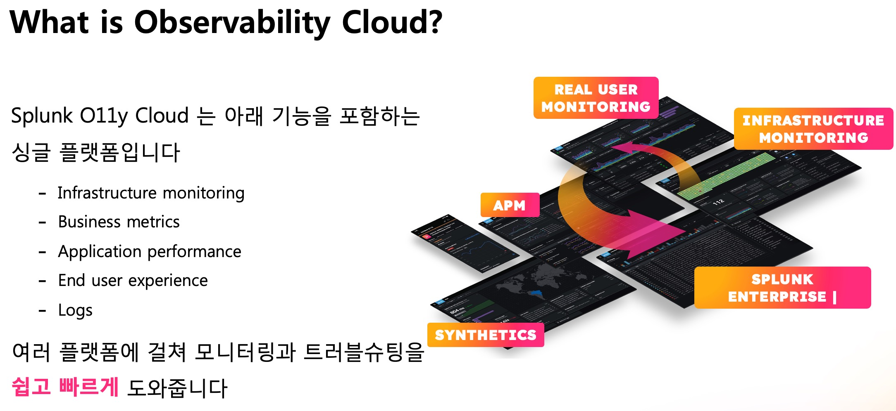
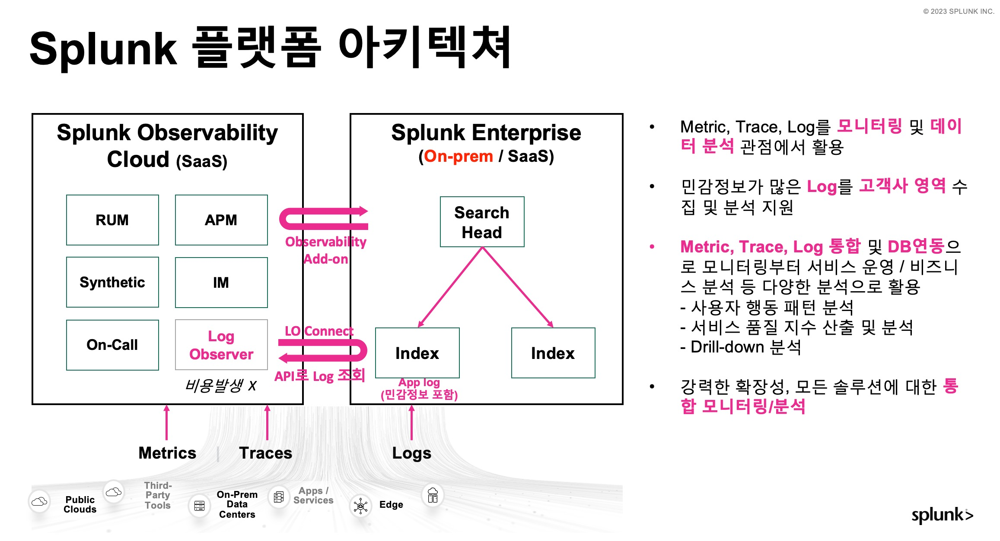
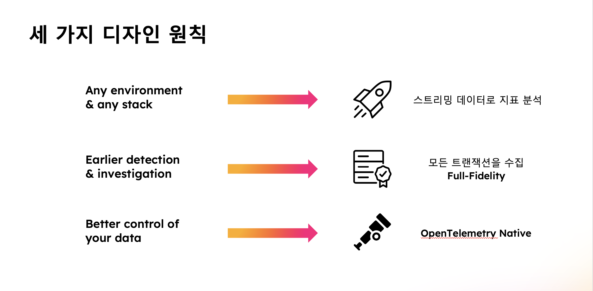
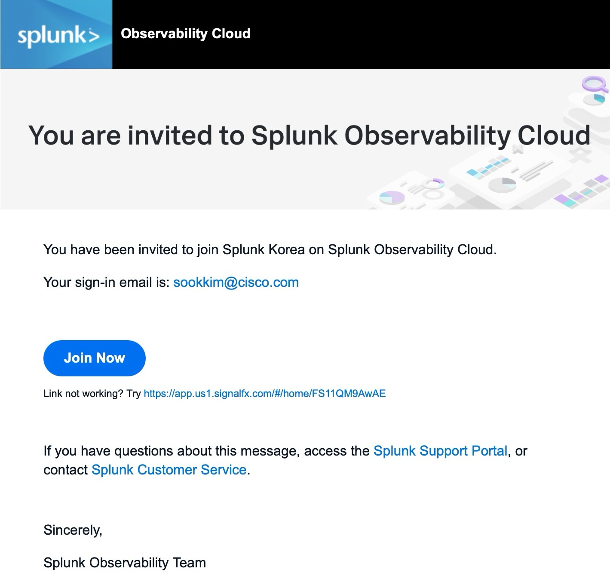
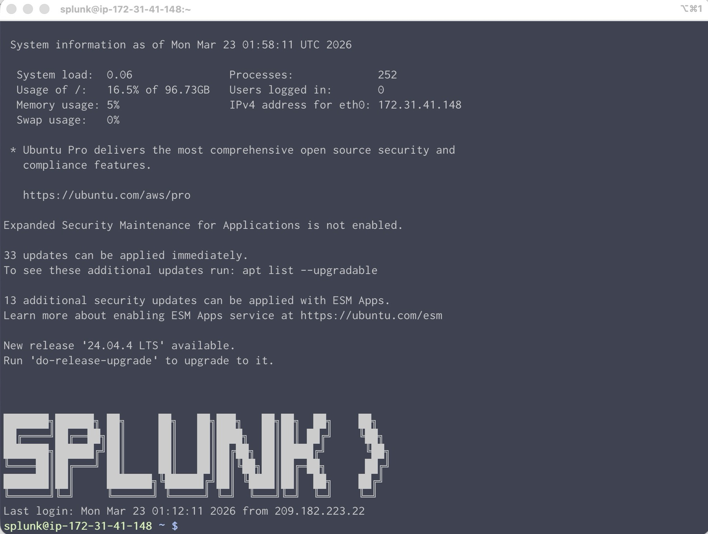

# 1. Microservice Workshop : 실습 환경 준비하기

</br>

## Contents

| 시간        | 인덱스 | 내용                                                                                          | 예상 시간 | 설명                                                                                                                                                                               |
| ----------- | ------ | --------------------------------------------------------------------------------------------- | --------- | ---------------------------------------------------------------------------------------------------------------------------------------------------------------------------------- |
| 10:00~10:10 | 0      | [개요 설명 & 실습 환경 접속](./1-2-index.html)                                                | 10분      |                                                                                                                                                                                    |
| 10:10~10:30 | 1      | [OTel Collector 설치 (**IM**)](./1-2-1-DeployOpenTelemetryCollector/1-2-1-index.html)         | 20분      | Splunk OTel 에이전트를 설치하고 O11y Cloud 로 이동하여 **인프라 모니터링** 데이터가 올바르게 수집하는지 확인합니다                                                                 |
| 10:30~10:50 | 2      | [Pet Clinic JAVA APP 구동시키기](./1-2-2-DeployJavaAPP/1-2-2-index.html)                      | 20분      | Linux 환경에 Springboot 기반의 샘플 앱을 구동시켜 APM 실습을 준비합니다                                                                                                            |
| 10:50~11:20 | 3      | [Java Instrumentation (**APM**)](./1-2-3-InstrumentJavaAPPwithOpenTelemetry/1-2-3-index.html) | 30분      | Manual Instrument 와 Zero-code Instrument 를 비교 해 보고, Zero-code instrument 를 이용하여 **APM** 데이터를 수집 해 봅니다                                                        |
| 11:20~12:00 | 4      | [Log collection to Splunk Cloud (**Log**)](./1-2-4-CollectLogs/1-2-4-index.html)              | 40분      | 애플리케이션에서 파일형태로 로그를 발생시키도록 설정 한 후, 파일에서 로그를 읽어 Splunk **로그 플랫폼** 으로 전송하도록 설정합니다.                                                |
|             |        | **1H 30Min Lunch Time**                                                                       |
| 13:30~13:50 | 5      | [Related Content 로 통합 분석하기](./1-2-5-RelatedContent/1-2-5-index.html)                   | 20분      | 메트릭 측정데이터와 로그의 저장소가 별도이므로 Related Content 를 통해 통합 분석을 하는 방안에 대해서 설명합니다. 로그플랫폼에서 메트릭 및 APM 데이터를 조회하는 방식을 사용합니다 |
| 13:50~14:00 | 6      | [Set Log Observer connector](./1-2-6-LogObserverConnector/1-2-6-index.html)                   | 10분      | O11y Cloud 에서 APM 을 통해 에러가 발견되었을 때, LOC 를 통해 로그 연계분석 방안을 실습합니다. 5번 내용과 반대로 O11y Cloud에서 로그를 조회하는 방식을 사용합니다                  |
| 14:00~14:40 | 7      | [Challenge : MySQL Receiver 추가하기](./1-2-7-ChallengeReceiver/1-2-7-index.html)             | 40분      | **Optional 항목입니다.** MySQL의 DB엔진 측정값을 수집하여 추가로 분석 할 수 있는 기능을 소개합니다.                                                                                |
|             |        | **20Min Break Time**                                                                          |
| 15:00~15:20 | 8      | [Splunk Log Platform 컨셉 소개](./1-2-5-RelatedContents/1-2-5-index.html)                     | 10분      | 로그를 저장하는 Splunk Platform에 대해 설명합니다                                                                                                                                  |
| 15:20~15:40 | 9      | [로그 데이터 수집](./1-1-6-LogObserverConnector/1-1-6-index.html)                             | 20분      | 로그 데이터를 어떤 방식으로 수집할 수 있는지 알아봅니다                                                                                                                            |
| 15:40~16:00 | 10     | [동적 필드 추출하기](./1-1-7-ChallengeReceiver/1-1-7-index.html)                              | 20분      | 로그에서 동적으로 동작하는 필드를 추출하여 분석하는 법을 실습합니다                                                                                                                |
| 16:00~16:30 | 11     | [Web Server 로그를 분석하여 대시보드 구축하기](./1-1-7-ChallengeReceiver/1-1-7-index.html)    | 30분      | 실습용으로 준비된 로그셋을 통해서 로그를 분석 해 보고, 추출한 값을 토대로 대시보드를 만들어봅니다                                                                                  |

</br>

## Understanding What is Splunk Observability Cloud



</br>



</br>



</br>

## Set up your Hands-on Environment

오늘 핸즈온 트레이닝을 진행하기 위해서는 각자의 로컬환경에 아래 내용이 준비되어 있어야 합니다.

- 유무선 인터넷 접속
- SSH 접속 가능한 터미널
- Observability Cloud 핸즈온 환경 접속 정보 - [링크 클릭](https://cisco.box.com/s/zi4ws67vlkeaqbiw39t7ochkpgnc7q9c) **수정필요**
- Splunk Observability Cloud - Splunk Korea organization 으로 접속
  

</br>

### 오늘은 실습 환경은 이렇게 되어 있습니다

본 워크숍의 목표는 Splunk의 Infra Monitoring, APM, Log 를 모두 학습하는 것입니다.

워크샵 시나리오는 Kubernetes에 간단한 ( 계측되지 않은 ) Java 마이크로서비스 애플리케이션을 설치하여 구현됩니다.

기존 Java 기반 배포 환경에 대한 자동 검색 기능을 갖춘 Splunk OpenTelemetry Collector를 설치하는 간단한 단계를 따라하면 메트릭, 추적 및 로그를 Splunk Observability Cloud 로 전송하는 것이 가능합니다.

샘플로 구현할 Spring PetClinic Java 애플리케이션은 프런트엔드와 백엔드 서비스로 구성된 간단한 마이크로서비스 애플리케이션입니다. 프런트엔드 서비스는 백엔드 서비스와 상호 작용하는 웹 인터페이스를 제공하는 Spring Boot 애플리케이션입니다. 백엔드 서비스는 MySQL 데이터베이스와 상호 작용하는 RESTful API를 제공하는 Spring Boot 애플리케이션입니다.

</br>


</br>

### SSH 접속을 테스트 해 봅시다

1. 위 사전 준비 정보 중 핸즈온 환경 접속 정보 - [Observability Cloud](https://cisco.box.com/s/zi4ws67vlkeaqbiw39t7ochkpgnc7q9c) 파일을 열어 봅니다
2. **ssh** 컬럼에 쓰여진 명령어를 그대로 복사하여 터미널에 붙여넣은 후 패스워드는 **sshPassword** 칼럼을 복사하여 입력합니다

   ```bash
   ]$ ssh -p 2222 splunk@54.180.147.112

    Warning: Permanently added '[54.180.147.112]:2222' (ED25519) to the list of known hosts.

    ░█▀▀▀█ ░█─░█ ░█▀▀▀█ ░█──░█
    ─▀▀▀▄▄ ░█▀▀█ ░█──░█ ░█░█░█
    ░█▄▄▄█ ░█─░█ ░█▄▄▄█ ░█▄▀▄█

    splunk@54.180.147.112's password: <여기에 패스워드 입력>

   ```

    </br>

    

</br>

---

**Module 0. Monolith Workshop : 실습 환경 준비하기 DONE!**
