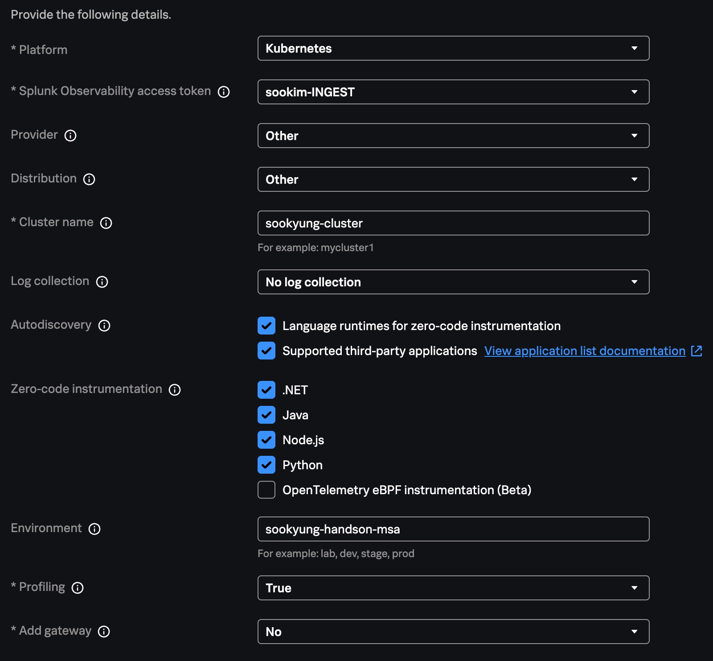
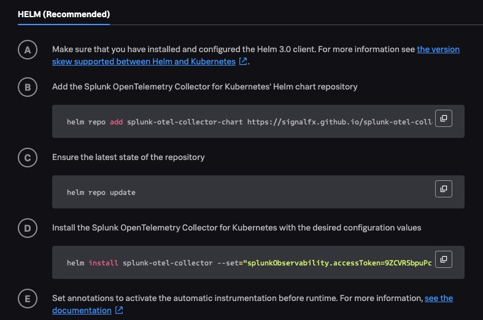
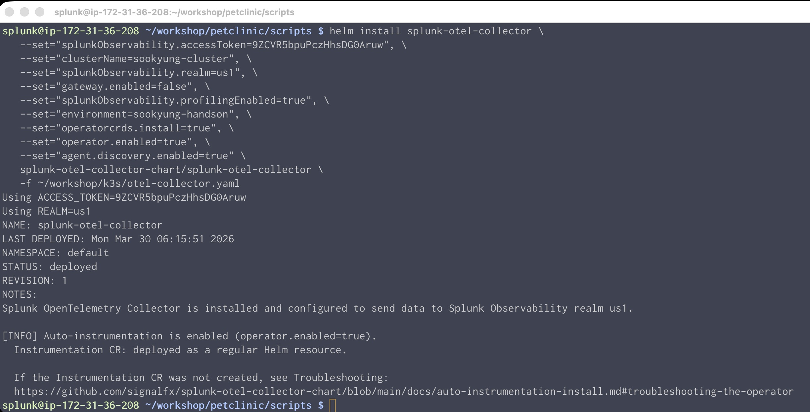
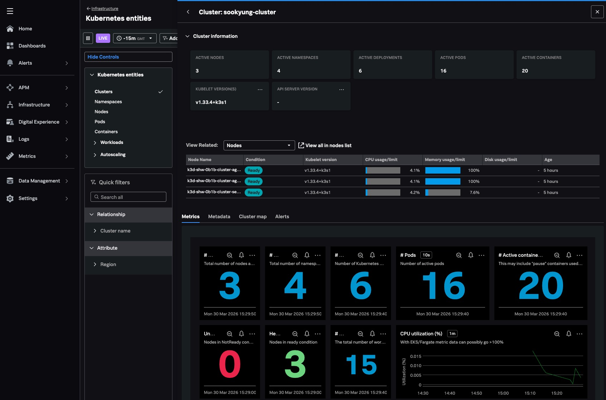

# 1. Deploy the OpenTelemetry Collector

에이전트를 설치한다는 것은, 인프라 모니터링을 시작한다는 말과 동시에 모든 유형의 텔레메트리 데이터 수집의 기본이 됩니다.

> [!WARNING]
>
> **기존 OpenTelemetry 수집기를 모두 제거하세요.**
>
> 이미 Splunk OpenTelemetry가 구동중이라면 다음 커맨드를 통하여 Otel을 삭제해야합니다.
>
> ```bash
> helm delete splunk-otel-collector
> ```
>
> EC2 인스턴스에 이미 이전 버전의 컬렉터가 설치되어 있을 수 있습니다. 컬렉터를 제거하려면 다음 명령을 실행하십시오.
>
> ```bash
> curl -sSL https://dl.signalfx.com/splunk-otel-collector.sh > /tmp/splunk-otel-collector.sh
>
> sudo sh /tmp/splunk-otel-collector.sh --uninstall
> ```

</br>

## Deploy the OpenTelemetry Collector

이제 해당 호스트에 에이전트를 설치 해 봅니다. 설치 방안은 여러가지가 있지만, 오늘 실습에서는 Splunk O11y Cloud UI 에서 제공하는 마법사를 통해 원하는 옵션이 미리 설정 된 스크립트를 통하여 설치를 진행합니다.

1. Splunk Observability Cloud 웹 페이지로 접속합니다

<!--
1. Splunk Access token을 미리 발급해 주세요.
   - Settings > Access Tokens > Create Token > API token
-->

2. Splunk Opentelemetry Collector 를 설치합니다
   - **[Data Management] > [Available Integration] > [Splunk OpenTelemetry Collector]**
   - Platform : Kubernetees
   - Splunk Observability access token : **kr-partnerworkshop-INGEST** 선택 - 동일한 토큰이 없을때는 강사가 알려주는 토큰을 사용하세요
   - Cluster name : **_<실습자이름>_-cluster**
   - Environment : **_<실습자이름>_-handson-msa**
     
   - [Next] 클릭

3. Install Script

   화면에 표시된 인스톨 스크립트를 복사하여 SSH 터미널에 붙여넣기 합니다. 에이전트 구동에 필요한 패키지를 일괄 다운로드 및 설치하므로 시간이 조금 소요됩니다.
   

   ```bash
   helm repo add splunk-otel-collector-chart https://signalfx.github.io/splunk-otel-collector-chart

   helm repo update
   ```

   여기서 마지막으로 표시되는 helm install 스크립트를 자세히 살펴봅니다

   ```bash
   helm install splunk-otel-collector \
   --set="splunkObservability.accessToken=<ingest_token>", \
   --set="clusterName=sookyung-cluster", \
   --set="splunkObservability.realm=us1", \
   --set="gateway.enabled=false", \
   --set="splunkObservability.profilingEnabled=true", \
   --set="environment=sookyung-handson", \
   --set="operatorcrds.install=true", \
   --set="operator.enabled=true", \
   --set="agent.discovery.enabled=true" \
   splunk-otel-collector-chart/splunk-otel-collector
   ```

   

- 참고 : [Install the Collector for Kubernetes using Helm](https://help.splunk.com/en/splunk-observability-cloud/manage-data/splunk-distribution-of-the-opentelemetry-collector/get-started-with-the-splunk-distribution-of-the-opentelemetry-collector/collector-for-kubernetes/install-with-helm)

</br>

4. OTel 에이전트 파드가 제대로 구동중인지 확인합니다

   ```bash
   $ kubectl get pods | grep splunk-otel
   splunk-otel-collector-agent-jqshf                            1/1     Running   0          2m20s
   splunk-otel-collector-agent-m6b2s                            1/1     Running   0          2m20s
   splunk-otel-collector-agent-z7tmr                            1/1     Running   0          2m20s
   splunk-otel-collector-k8s-cluster-receiver-c4f66966d-49slc   1/1     Running   0          2m20s
   splunk-otel-collector-operator-794c5fc9f7-n2hpb              2/2     Running   0          2m20s
   ```

</br>

## collector의 로그를 어떻게 하면 볼 수 있을까요?

에이전트의 컨테이너 로그를 조회하여 collector의 로그를 볼 수 있습니다:

```bash
kubectl logs -l app=splunk-otel-collector -f --container otel-collector
```

> [!NOTE]
>
> Press Ctrl + C to exit out of tailing the log.

<br>

## Collector 의 설정파일 (configuration files)은 어디에 있을까요?

HELM 설치 시 yaml 파일을 통해 설정 및 업데이트를 관리해야합니다. 하지만 우리는 앞선 에이전트 설치 과정에서, yaml 파일을 다운로드 받거나 수정하지 않았습니다.
One-line 커멘드를 이용하여 원격 yaml 파일을 불러 온 후 파라메터를 이용하여 옵션값을 주입하여 설치하였으므로 아래 명령어를 통해 yaml 을 추출합니다

```bash
helm get values splunk-otel-collector -n default -a -o yaml > ~/workshop/k3s/values.yaml
```

아래 디렉토리로 이동하여 파일이 제대로 생성 및 반영되었는지 확인합니다

```bash
cd ~workshop/k3s/

vi values.yaml
```

Gen AI 에 특화된 모니터링을 위해 아래와 같은 설정을 집어넣어 봅시다.

```yaml
agent:
  config:
    exporters:
      signalfx:
        send_otlp_histograms: true
```

이 사용자 지정 구성을 통해 익스포터가 수신한 모든 히스토그램 메트릭은 SignalFx 형식으로 변환되지 않고 OTLP 형식으로 Splunk Observability 백엔드로 전송됩니다. 이 설정은 `gen_ai.evaluation.score` 와 같이 AI 에이전트 모니터링에서 사용하는 히스토그램 메트릭이 예상대로 처리되도록 하는 데 매우 중요합니다.

이제 다음 명령어를 사용하여 컬렉터를 재배포 합니다

```bash
helm upgrade splunk-otel-collector -f ./vlues.yaml splunk-otel-collector-chart/splunk-otel-collector
```

OTel 에이전트 파드가 제대로 구동중인지 확인합니다

```bash
$ kubectl get pods | grep splunk-otel
splunk-otel-collector-agent-jqshf                            1/1     Running   0          2m20s
splunk-otel-collector-agent-m6b2s                            1/1     Running   0          2m20s
splunk-otel-collector-agent-z7tmr                            1/1     Running   0          2m20s
splunk-otel-collector-k8s-cluster-receiver-c4f66966d-49slc   1/1     Running   0          2m20s
splunk-otel-collector-operator-794c5fc9f7-n2hpb              2/2     Running   0          2m20s
```

</br>

## 데이터가 정상적으로 수집되는지 확인 해 봅시다

Splunk Observability Cloud 화면으로 가서 인프라 메트릭이 제대로 수집되는지 확인 해 봅시다.

- **[Infrastructure] > [Kubernetes] > [Kubernetes overview]** 타일을 눌러 네비게이터로 이동합니다
- 클러스터 메뉴로 들어가서, 내 이름으로 설정된 K8S 클러스터가 보이면 이름을 클릭하여 세부정보를 살펴봅니다
  

</br>

---

**Module 1. Deploy the OpenTelemetry Collector DONE!**
