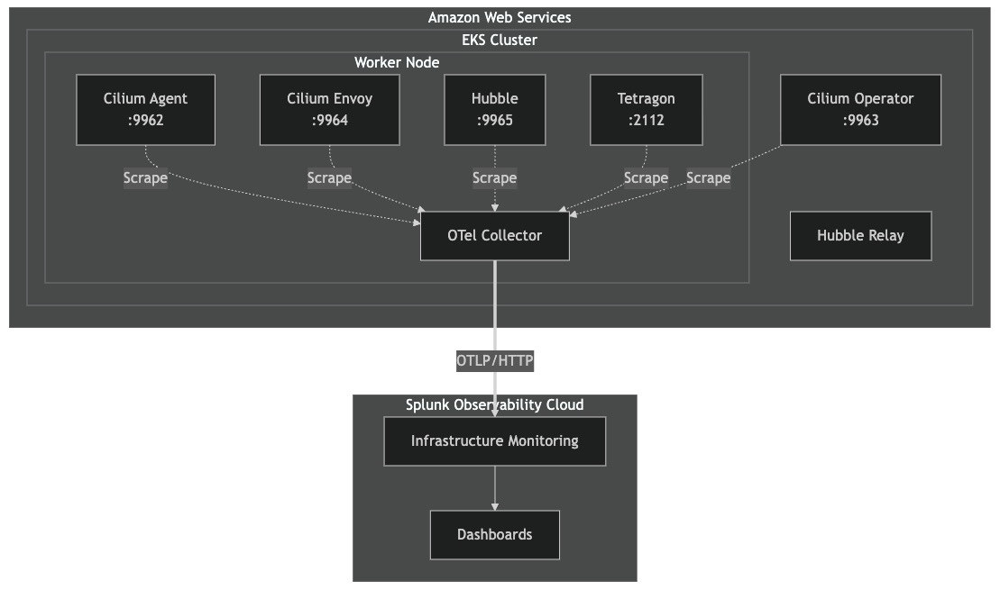

# Set up EKS Cluster

우리의 실습용 환경이자 테스트 환경을 구동시킬 EKS Cluster를 아래 절차를 통해 생성합니다

## 1. Helm 저장소 추가

아래 명령어를 통해 Helm 저장소를 추가합니다

```bash
# Add Isovalent Helm repository
helm repo add isovalent https://helm.isovalent.com

# Add Splunk OpenTelemetry Collector Helm repository
helm repo add splunk-otel-collector-chart https://signalfx.github.io/splunk-otel-collector-chart

# Update Helm repositories
helm repo update
```

</br>

## 2. EKS 클러스터를 위한 Config 생성

아래 절차를 따라서 구성요소가 생성될 디렉토리 하나를 만들고, 해당 디렉토리 하위에 `cluster.yaml` 파일을 생성합니다

```bash
mkdir ~/isovalent
cd ~/isovalent
vi cluster.yaml
```

```yaml
# cluster.yaml
apiVersion: eksctl.io/v1alpha5
kind: ClusterConfig
metadata:
  name: isovalent-demo
  region: ap-northeast-2
  version: '1.30'
  tags:
    splunkit_environment_type: non-prd
    splunkit_data_classification: public

vpc:
  cidr: '10.0.0.0/16'
  clusterEndpoints:
    publicAccess: true

iam:
  withOIDC: true
addonsConfig:
  disableDefaultAddons: true
addons:
  - name: coredns
```

### 주요 구성 세부 정보:

- `disableDefaultAddons: true` - AWS VPC CNI 및 kube-proxy를 비활성화합니다(Cilium이 둘 다 대체합니다).
- `withOIDC: true` - 서비스 계정에 대한 IAM 역할을 활성화합니다(Cilium이 ENI를 관리하는 데 필요함).
- `coredns` 애드온은 DNS 확인에 필요하므로 유지됩니다.

> [!NOTE]
> 기본 추가기능을 비활성화 하는 이유는? </br>
> Cilium은 기본 AWS VPC CNI보다 성능이 뛰어난 eBPF를 사용하는 자체 CNI 구현을 제공합니다. 기본 설정을 비활성화하면 충돌을 방지하고 Cilium이 모든 네트워킹을 처리하도록 할 수 있습니다.

</br>

## 3. EKS 클러스터 생성

AWS CLI가 해당 Linux 서버에서 실행 가능하고, 원하는 AWS 계정에 접근 가능한 상태인지 확인합니다. 아무 결과도 나오지 않는다면 aws configure 명령어로 설정을 먼저 진행합니다.

```bash
$ aws configure

AWS Access Key ID [None]: <iam_accesskey_입력>
AWS Secret Access Key [None]: <aws_secret_입력>
Default region name [None]: ap-northeast-2
Default output format [None]: json
```

아래 명령어를 통해 EKS cluster를 생성합니다 (약 15~20분 소요)

```bash
$ eksctl create cluster -f cluster.yaml

2026-04-29 07:32:31 [ℹ]  eksctl version 0.225.0
2026-04-29 07:32:31 [ℹ]  using region ap-northeast-2
2026-04-29 07:32:31 [ℹ]  setting availability zones to [ap-northeast-2d ap-northeast-2a ap-northeast-2c]
2026-04-29 07:32:31 [ℹ]  subnets for ap-northeast-2d - public:10.0.0.0/19 private:10.0.96.0/19
2026-04-29 07:32:31 [ℹ]  subnets for ap-northeast-2a - public:10.0.32.0/19 private:10.0.128.0/19
2026-04-29 07:32:31 [ℹ]  subnets for ap-northeast-2c - public:10.0.64.0/19 private:10.0.160.0/19
2026-04-29 07:32:31 [!]  Auto Mode will be enabled by default in an upcoming release of eksctl. This means managed node groups and managed networking add-ons will no longer be created by default. To maintain current behavior, explicitly set 'autoModeConfig.enabled: false' in your cluster configuration. Learn more: https://eksctl.io/usage/auto-mode/
2026-04-29 07:32:31 [ℹ]  using Kubernetes version 1.30
2026-04-29 07:32:31 [ℹ]  creating EKS cluster "isovalent-demo" in "ap-northeast-2" region with
2026-04-29 07:32:31 [ℹ]  if you encounter any issues, check CloudFormation console or try 'eksctl utils describe-stacks --region=ap-northeast-2 --cluster=isovalent-demo'
2026-04-29 07:32:31 [ℹ]  Kubernetes API endpoint access will use default of {publicAccess=true, privateAccess=false} for cluster "isovalent-demo" in "ap-northeast-2"
2026-04-29 07:32:31 [ℹ]  CloudWatch logging will not be enabled for cluster "isovalent-demo" in "ap-northeast-2"
2026-04-29 07:32:31 [ℹ]  you can enable it with 'eksctl utils update-cluster-logging --enable-types={SPECIFY-YOUR-LOG-TYPES-HERE (e.g. all)} --region=ap-northeast-2 --cluster=isovalent-demo'
2026-04-29 07:32:31 [ℹ]
2 sequential tasks: { create cluster control plane "isovalent-demo",
    4 sequential sub-tasks: {
        1 task: { create addons },
        wait for control plane to become ready,
        associate IAM OIDC provider,
        no tasks,
    }
}
2026-04-29 07:32:31 [ℹ]  building cluster stack "eksctl-isovalent-demo-cluster"
2026-04-29 07:32:31 [ℹ]  deploying stack "eksctl-isovalent-demo-cluster"
2026-04-29 07:33:01 [ℹ]  waiting for CloudFormation stack "eksctl-isovalent-demo-cluster"
2026-04-29 07:39:33 [ℹ]  creating addon: coredns
2026-04-29 07:39:34 [ℹ]  successfully created addon: coredns
2026-04-29 07:41:35 [ℹ]  waiting for the control plane to become ready
2026-04-29 07:41:35 [✔]  saved kubeconfig as "/home/splunk/.kube/config"
2026-04-29 07:41:35 [ℹ]  no tasks
2026-04-29 07:41:35 [✔]  all EKS cluster resources for "isovalent-demo" have been created
2026-04-29 07:41:37 [ℹ]  kubectl command should work with "/home/splunk/.kube/config", try 'kubectl get nodes'
2026-04-29 07:41:37 [✔]  EKS cluster "isovalent-demo" in "ap-northeast-2" region is ready
```

아래 명령어로 클러스터 생성을 확인합니다

```bash
# Update kubeconfig
$ aws eks update-kubeconfig --name isovalent-demo --region ap-northeast-2

Added new context arn:aws:eks:ap-northeast-2:851725560135:cluster/isovalent-demo to /home/splunk/.kube/config

# Check pods
$ kubectl get pods -n kube-system

NAME                      READY   STATUS    RESTARTS   AGE
coredns-7875f67b5-bnxgj   0/1     Pending   0          4m30s
coredns-7875f67b5-mk8ts   0/1     Pending   0          4m30s
```

> [!WARNING]
> CNI 플러그인이 없으면 Pod는 IP 주소나 네트워크 연결을 얻을 수 없습니다. Cilium이 설치될 때까지 CoreDNS는 대기 상태로 유지됩니다.

</br>

## Architecture



</br>

## Key Components

| Component       | Service Name    | Port | Purpose                              |
| --------------- | --------------- | ---- | ------------------------------------ |
| Cilium Agent    | cilium-agent    | 9962 | CNI, network policies, eBPF programs |
| Cilium Envoy    | cilium-envoy    | 9964 | L7 proxy for HTTP, gRPC              |
| Cilium Operator | cilium-operator | 9963 | Cluster-wide operations              |
| Hubble          | hubble-metrics  | 9965 | Network flow metrics                 |
| Tetragon        | tetragon        | 2112 | Runtime security metrics             |

</br>

## eBPF 사용의 이점

- 고성능 : 최소한의 오버헤드로 Linux 커널에서 실행됩니다.
- 안전성 : 검증 도구는 프로그램이 안전하게 실행되도록 보장합니다.
- 유연성 : 커널 모듈 없이 동적 계측 가능
- 가시성 : 네트워크 및 시스템 동작에 대한 심층적인 통찰력

_이 통합을 통해 기존 CNI 플러그인으로는 불가능했던 수준의 Kubernetes 네트워킹 가시성을 확보할 수 있습니다._

</br>

## Pre-requisite

### SSH 접속을 테스트 해 봅시다

1. 핸즈온 환경 접속 정보 파일을 열어 봅니다
2. **ssh** 컬럼에 쓰여진 명령어를 그대로 복사하여 터미널에 붙여넣은 후 패스워드는 **sshPassword** 칼럼을 복사하여 입력합니다

   ```bash
   ]$ ssh -p 2222 splunk@54.180.147.112

    Warning: Permanently added '[54.180.147.112]:2222' (ED25519) to the list of known hosts.

    ░█▀▀▀█ ░█─░█ ░█▀▀▀█ ░█──░█
    ─▀▀▀▄▄ ░█▀▀█ ░█──░█ ░█░█░█
    ░█▄▄▄█ ░█─░█ ░█▄▄▄█ ░█▄▀▄█

    splunk@54.180.147.112's password: <여기에 패스워드 입력>

   ```

    </br>

    

</br>

### 필요한 패키지가 모두 인스톨 되어있는지 확인합니다

```bash
kubectl version --client

aws --version

helm version
```

이 실습에 필요한 eksctl 은 설치되어있지 않으므로 아래 명령어를 통해 설치를 진행합니다

```bash
ARCH=amd64
PLATFORM=$(uname -s)_$ARCH

curl -sLO "https://github.com/eksctl-io/eksctl/releases/latest/download/eksctl_$PLATFORM.tar.gz"

tar -xzf eksctl_$PLATFORM.tar.gz -C /tmp && rm eksctl_$PLATFORM.tar.gz

sudo install -m 0755 /tmp/eksctl /usr/local/bin && rm /tmp/eksctl

eksctl version
```

</br>

---

**Module 1. Isovalent Overview & Prerequisite DONE!**
