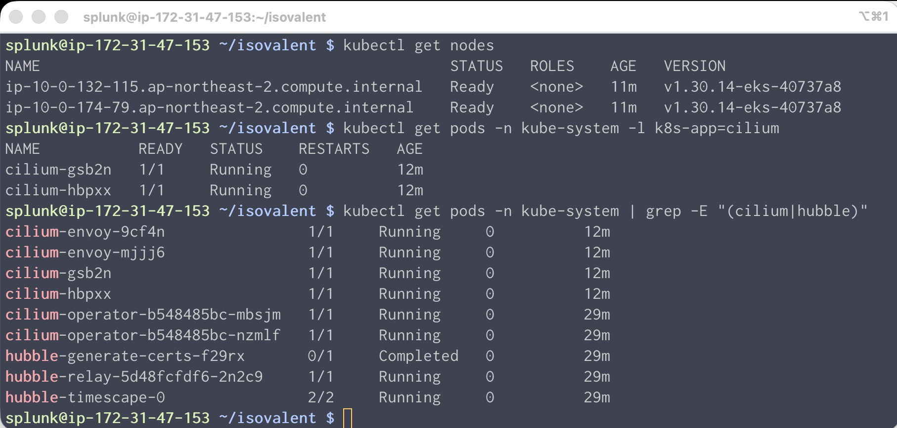

# Cilium Installation

우리의 실습용 환경이자 테스트 환경을 구동시킬 EKS Cluster를 아래 절차를 통해 생성합니다

## 1. Cilium Enterprise 를 위한 Config 생성

Cilium을 설치하기 위해 yaml 파일을 먼저 생성하고, 필요한 설정을 정의해야합니다. 우리가 앞선 단계에서 생성한 디렉토리로 이동하여 `cilium-enterprise-values.yaml` 이름의 파일을 생성합니다

아래 설정 내용 중 k8sServiceHost: <YOUR-EKS-API-SERVER-ENDPOINT> 부분의 값을 앞선 모듈에서 복사한 K8S API Server 엔드포인트로 바꾸고 저장합니다

```yaml
# Enable/disable debug logging
debug:
  enabled: false
  verbose: ~

# Configure unique cluster name & ID
cluster:
  name: isovalent-demo
  id: 0

# Configure ENI specifics
eni:
  enabled: true
  updateEC2AdapterLimitViaAPI: true # Dynamically fetch ENI limits from EC2 API
  awsEnablePrefixDelegation: true # Assign /28 CIDR blocks per ENI (16 IPs) instead of individual IPs

enableIPv4Masquerade: false # Pods use their real VPC IPs — no SNAT needed in ENI mode
loadBalancer:
  serviceTopology: true # Prefer backends in the same AZ to reduce cross-AZ traffic costs

ipam:
  mode: eni

routingMode: native # No overlay tunnels — traffic routes natively through VPC

# BPF / KubeProxyReplacement
# Cilium replaces kube-proxy entirely with eBPF programs in the kernel.
# This requires a direct path to the API server, hence k8sServiceHost.
kubeProxyReplacement: 'true'
k8sServiceHost: <YOUR-EKS-API-SERVER-ENDPOINT>
k8sServicePort: 443

# TLS for internal Cilium communication
tls:
  ca:
    certValidityDuration: 3650 # 10 years for the CA cert

# Hubble: network observability built on top of Cilium's eBPF datapath
hubble:
  enabled: true
  metrics:
    enableOpenMetrics: true # Use OpenMetrics format for better Prometheus compatibility
    enabled:
      # DNS: query/response tracking with namespace-level label context
      - dns:labelsContext=source_namespace,destination_namespace
      # Drop: packet drop reasons (policy deny, invalid, etc.) per namespace
      - drop:labelsContext=source_namespace,destination_namespace
      # TCP: connection state tracking (SYN, FIN, RST) per namespace
      - tcp:labelsContext=source_namespace,destination_namespace
      # Port distribution: which destination ports are being used
      - port-distribution:labelsContext=source_namespace,destination_namespace
      # ICMP: ping/traceroute visibility with workload identity context
      - icmp:labelsContext=source_namespace,destination_namespace;sourceContext=workload-name|reserved-identity;destinationContext=workload-name|reserved-identity
      # Flow: per-workload flow counters (forwarded, dropped, redirected)
      - flow:sourceContext=workload-name|reserved-identity;destinationContext=workload-name|reserved-identity
      # HTTP L7: request/response metrics with full workload context and exemplars for trace correlation
      - 'httpV2:exemplars=true;labelsContext=source_ip,source_namespace,source_workload,destination_namespace,destination_workload,traffic_direction;sourceContext=workload-name|reserved-identity;destinationContext=workload-name|reserved-identity'
      # Policy: network policy verdict tracking (allowed/denied) per workload
      - 'policy:sourceContext=app|workload-name|pod|reserved-identity;destinationContext=app|workload-name|pod|dns|reserved-identity;labelsContext=source_namespace,destination_namespace'
      # Flow export: enables Hubble to export flow records to Timescape for historical storage
      - flow_export
    serviceMonitor:
      enabled: true # Creates a Prometheus ServiceMonitor for auto-discovery
  tls:
    enabled: true
    auto:
      enabled: true
      method: cronJob # Automatically rotate Hubble TLS certs on a schedule
      certValidityDuration: 1095 # 3 years per cert rotation
  relay:
    enabled: true # Hubble Relay aggregates flows from all nodes cluster-wide
    tls:
      server:
        enabled: true
    prometheus:
      enabled: true
      serviceMonitor:
        enabled: true
  timescape:
    enabled: true # Stores historical flow data for time-travel debugging

# Cilium Operator: cluster-wide identity and endpoint management
operator:
  prometheus:
    enabled: true
    serviceMonitor:
      enabled: true

# Cilium Agent: per-node eBPF datapath metrics
prometheus:
  enabled: true
  serviceMonitor:
    enabled: true

# Cilium Envoy: L7 proxy metrics (HTTP, gRPC)
envoy:
  prometheus:
    enabled: true
    serviceMonitor:
      enabled: true

# Enable the Cilium agent to hand off DNS proxy responsibilities to the
# external DNS Proxy HA deployment, so policies keep working during upgrades
extraConfig:
  external-dns-proxy: 'true'

# Enterprise feature gates — these must be explicitly approved
enterprise:
  featureGate:
    approved:
      - DNSProxyHA # High-availability DNS proxy (installed separately)
      - HubbleTimescape # Historical flow storage via Timescape
```

</br>

## 2. Cilium Enterprise 설치하기

새 노드가 EKS 클러스터에 합류하면 해당 노드의 kubelet은 즉시 네트워킹 설정을 위해 CNI 플러그인을 찾기 시작합니다. kubelet은 `/etc/cni/net.d/` 경로에 존재하는 모든 CNI 구성을 읽어 노드를 초기화하는 데 사용합니다. **노드 그룹을 먼저 생성하면 AWS VPC CNI가 먼저 할당됩니다.** 그렇게 되면 이후에 다른 CNI로 전환하려면 노드를 드레인하고 다시 초기화해야 합니다.

노드가 생성되기 전에 Cilium을 설치하면 `kube-system` 내에 Cilium의 CNI 구성이 이미 준비되어 노드가 시작되는 순간 바로 사용할 수 있게 됩니다. EC2 인스턴스가 부팅되면 Cilium의 DaemonSet Pod가 즉시 스케줄링되고 eBPF 프로그램이 로드되어 노드가 첫 순간부터 `Ready` 상태로 Cilium의 제어 하에 작동하게 됩니다.

이것이 바로 EKS 설정 3단계에서 `disableDefaultAddons: true` 설정과 함께 클러스터를 생성하는 이유입니다 . 클러스터를 생성하지 않으면 AWS VPC CNI가 자동으로 설치되어 Cilium과 충돌이 발생할 수 있습니다.

아래 명령어로 Helm을 사용하여 Cilium을 설치하세요

```bash
helm install cilium isovalent/cilium --version 1.18.4 \
  --namespace kube-system -f cilium-enterprise-values.yaml
```

kubectl get pods -A 명령어로 파드를 조회 해보면 모든 파드가 pending 상태로 표현됩니다. 아직 해당 파드 및 컨테이너가 할당 될 노드를 생성하지 않았으므로 정상적인 상태입니다.

</br>

## 3. Nodegroup 생성하기

노드그룹 생성을 위해 `nodegroup.yaml` 이름의 파일을 생성합니다

```yaml
apiVersion: eksctl.io/v1alpha5
kind: ClusterConfig
metadata:
  name: isovalent-demo
  region: ap-northeast-2
managedNodeGroups:
  - name: standard
    instanceType: m5.xlarge
    desiredCapacity: 2
    privateNetworking: true
    tags:
      splunkit_environment_type: non-prd
      splunkit_data_classification: public
```

```bash
$ eksctl create nodegroup -f nodegroup.yaml

2026-04-29 08:36:07 [ℹ]  will use version 1.30 for new nodegroup(s) based on control plane version
2026-04-29 08:36:08 [ℹ]  nodegroup "standard" will use "" [AmazonLinux2023/1.30]
2026-04-29 08:36:08 [ℹ]  1 nodegroup (standard) was included (based on the include/exclude rules)
2026-04-29 08:36:08 [ℹ]  will create a CloudFormation stack for each of 1 managed nodegroups in cluster "isovalent-demo"
2026-04-29 08:36:08 [!]  "aws-node" was not found
2026-04-29 08:36:08 [ℹ]
2 sequential tasks: { fix cluster compatibility, 1 task: { 1 task: { create managed nodegroup "standard" } }
}
2026-04-29 08:36:08 [ℹ]  checking cluster stack for missing resources
2026-04-29 08:36:09 [ℹ]  cluster stack has all required resources
2026-04-29 08:36:09 [ℹ]  building managed nodegroup stack "eksctl-isovalent-demo-nodegroup-standard"
2026-04-29 08:36:09 [ℹ]  deploying stack "eksctl-isovalent-demo-nodegroup-standard"
2026-04-29 08:36:09 [ℹ]  waiting for CloudFormation stack "eksctl-isovalent-demo-nodegroup-standard"
2026-04-30 05:15:55 [ℹ]  no tasks
2026-04-30 05:15:55 [✔]  created 0 nodegroup(s) in cluster "isovalent-demo"
2026-04-30 05:15:55 [ℹ]  nodegroup "standard" has 2 node(s)
2026-04-30 05:15:55 [ℹ]  node "ip-10-0-132-115.ap-northeast-2.compute.internal" is ready
2026-04-30 05:15:55 [ℹ]  node "ip-10-0-174-79.ap-northeast-2.compute.internal" is ready
2026-04-30 05:15:55 [ℹ]  waiting for at least 2 node(s) to become ready in "standard"
2026-04-30 05:15:55 [ℹ]  nodegroup "standard" has 2 node(s)
2026-04-30 05:15:55 [ℹ]  node "ip-10-0-132-115.ap-northeast-2.compute.internal" is ready
2026-04-30 05:15:55 [ℹ]  node "ip-10-0-174-79.ap-northeast-2.compute.internal" is ready
2026-04-30 05:15:55 [✔]  created 1 managed nodegroup(s) in cluster "isovalent-demo"
2026-04-30 05:15:55 [ℹ]  checking security group configuration for all nodegroups
2026-04-30 05:15:55 [ℹ]  all nodegroups have up-to-date cloudformation templates
```

</br>

## 4. Cilium 설치 확인하기

아래 명령어로 설치가 올바르게 되었는지 확인합니다

```bash
# Check nodes
kubectl get nodes

# Check Cilium pods
kubectl get pods -n kube-system -l k8s-app=cilium

# Check all Cilium components
kubectl get pods -n kube-system | grep -E "(cilium|hubble)"
```

명령어로 조회했을때 아래와 같은 사항이 확인되어야 정상 상태라고 볼 수 있습니다.

- 2개의 노드가 Ready상태 에 있습니다.
- Cilium pod 실행 중 (노드당 1개)
- 허블 및 타임스케이프 실행 중
- Cilium operator 실행 중

  

</br>

## 5. Tetragon 설치 하기

Tetragon은 기본적으로 런타임 보안 및 프로세스 수준 가시성을 제공합니다. Splunk 통합, 특히 Network Explorer 대시보드를 사용하려면 TCP/UDP 소켓 통계, RTT, 연결 이벤트 및 DNS를 커널 수준에서 추적하는 향상된 네트워크 관찰 모드를 활성화하는 것이 좋습니다.

다음과 같은 이름의 파일을 생성하세요

`tetragon-network-values.yaml`

```yaml
# Tetragon configuration with Enhanced Network Observability enabled
# Required for Splunk Observability Cloud Network Explorer integration

tetragon:
  # Enable network events — this activates eBPF-based socket tracking
  enableEvents:
    network: true

  # Layer3 settings: track TCP, UDP, and ICMP with RTT and latency
  # These enable the socket stats metrics (srtt, retransmits, bytes, etc.)
  layer3:
    tcp:
      enabled: true
      rtt:
        enabled: true # Round-trip time per TCP flow
    udp:
      enabled: true
    icmp:
      enabled: true
    latency:
      enabled: true # Per-connection latency tracking

  # DNS tracking at the kernel level (complements Hubble DNS metrics)
  dns:
    enabled: true

  # Expose Tetragon metrics via Prometheus
  prometheus:
    enabled: true
    serviceMonitor:
      enabled: true

  # Filter out noise from internal system namespaces — we only care about
  # application workloads, not the observability stack itself
  exportDenyList: |-
    {"health_check":true}
    {"namespace":["", "cilium", "tetragon", "kube-system", "otel-splunk"]}

  # Only include labels that are meaningful for the Network Explorer
  metricsLabelFilter: 'namespace,workload,binary'

  resources:
    limits:
      cpu: 500m
      memory: 1Gi
    requests:
      cpu: 100m
      memory: 256Mi

# Enable the Tetragon Operator and TracingPolicy support.
# With tracingPolicy.enabled: true, the operator manages and deploys
# TracingPolicies (TCP connection tracking, HTTP visibility, etc.) automatically.
tetragonOperator:
  enabled: true
  tracingPolicy:
    enabled: true
```

저장하고 빠져나온 뒤 아래 명령어로 설치를 진행합니다

```bash
$ pwd
/home/splunk/isovalent

$ helm install tetragon isovalent/tetragon --version 1.18.0 \
  --namespace tetragon --create-namespace \
  -f tetragon-network-values.yaml
```

이제 설치가 제대로 되었는지 확인합니다

```bash
$ kubectl get pods -n tetragon

NAME                                READY   STATUS    RESTARTS   AGE
tetragon-bjnmj                      1/1     Running   0          41s
tetragon-operator-8bf5847b6-9cksh   1/1     Running   0          41s
tetragon-sw77g                      1/1     Running   0          41s
```

> [!NOTE] NOTE </br>
> Tetragon을 통한 네트워크 모니터링의 이점은 무엇일까요? </br>
> layer3.tcp.rtt.enabled: true 라는 설정값을 통해 Tetragon은 이 기능을 통해 커널의 TCP 소켓 상태에 연결하여 왕복 시간, 재전송 횟수, 송수신 바이트 수, 세그먼트 수 등 연결별 메트릭을 기록합니다. tetragon*socket_stats*\* 이름으로 시작하는 메트릭은 Splunk의 네트워크 탐색기에서 지연 시간 및 처리량 보기에 사용됩니다. 이 기능을 사용하지 않으면 이벤트 수만 얻을 수 있지만, 사용하면 연결 품질 데이터를 얻을 수 있습니다.

</br>

## 6. Cilium DNS Proxy HA 설치하기

여전히 작업중인 isovalent 디렉토리에 `cilium-dns-proxy-ha-values.yaml` 이름의 파일을 생성합니다

```yaml
enableCriticalPriorityClass: true
metrics:
  serviceMonitor:
    enabled: true
```

Helm을 통해 DNS 프록시 HA 를 설치후 설치가 잘 되었는지 확인합니다

```bash
$ helm upgrade -i cilium-dnsproxy isovalent/cilium-dnsproxy --version 1.16.7 \
  -n kube-system -f cilium-dns-proxy-ha-values.yaml
Using ACCESS_TOKEN=
Using REALM=us1
Release "cilium-dnsproxy" does not exist. Installing it now.
NAME: cilium-dnsproxy
LAST DEPLOYED: Thu Apr 30 05:48:23 2026
NAMESPACE: kube-system
STATUS: deployed
REVISION: 1
TEST SUITE: None

$ kubectl rollout status -n kube-system ds/cilium-dnsproxy --watch
daemon set "cilium-dnsproxy" successfully rolled out
```

이제 완벽하게 작동하는 Cilium CNI, Hubble observability 및 Tetragon security 가 설치완료 되었고, 해당 EKS 클러스터를 사용할 수 있습니다!

</br>

---

**Module 3. Cilium Installation DONE!**
